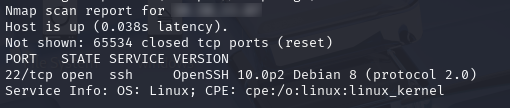
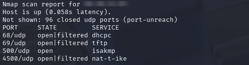
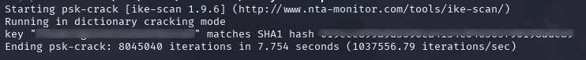
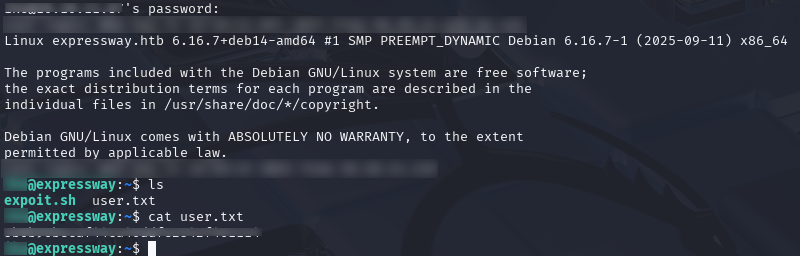
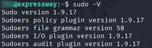
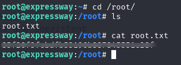

# Resumen

**Nombre del reto:** [Expressway](https://app.hackthebox.com/machines/736)

**Dificultad:** Fácil

**Objetivos:**
1. Conseguir acceso como usuario y obtener la `User Flag` 
2. Escalar privilegios y obtener la `Root Flag`
# Reconocimiento

El primer paso fue realizar tareas de **reconocimiento** utilizando `nmap`, con el objetivo de identificar puertos abiertos y servicios activos en la máquina. Comencé con un escaneo completo de puertos:

```bash
nmap -sV -sC -p- TARGET_IP
```

Este escaneo reveló únicamente el puerto 22 abierto, con un servicio OpenSSH versión 10.0p2.



Tras investigar dicha versión, no encontré vulnerabilidades conocidas que pudieran explotarse para obtener acceso.

Por defecto, `nmap` sólo escanea los puertos **TCP**, así que probé a lanzar un escaneo para puertos **UDP**. Dado que este tipo de escaneo es más lento, limité el comando a los 100 puertos UDP más comunes.

```bash
sudo nmap -sU --top-ports 100 TARGET_IP
```

Entre los resultados, se identificó el puerto 500 abierto.



Este puerto corresponde al protocolo **ISAKMP**, utilizado para negociar claves y asociaciones de seguridad en redes IP, especialmente en VPNs. Si está expuesto públicamente o mal configurado (por ejemplo, sin autenticación robusta o con versiones vulnerables de IKE), puede permitir a un atacante interceptar o manipular el proceso de negociación y acceder a la red interna.

Para analizar este servicio, utilicé la herramienta `ike-scan`, que permite identificar gateways VPN y detectar configuraciones débiles, como el uso de PSK (Pre-Shared Key) sin protección adecuada. Ejecuté el siguiente comando:

```bash
sudo ike-scan -A --pskcrack TARGET_IP
```
Donde:
- `-A`: activa el modo agresivo, que puede revelar más información del responder.
- `--pskcrack`: guarda los hashes de PSK obtenidos para intentar romperlos posteriormente mediante diccionario.

Como resultado, el servicio respondió con un posible nombre de usuario `USER@expressway.htb` y un hash que podría representar una credencial.


Guardé el hash en un archivo llamado `psk.txt` y utilicé el diccionario `rockyou` para realizar un ataque de fuerza bruta:

```bash
psk-crack -d /usr/share/wordlists/rockyou.txt psk.txt
```

Como resultado, obtuve una contraseña



# Acceso al sistema

Al obtener la credencial e intentar conectarme al servicio, pude confirmar que ISAKMP  no permite el acceso directo, por lo que la alternativa que probé fue utilizar la contraseña obtenida y el usuario `ike`, para conectarme mediante `ssh`.

```bash
ssh USER@TARGET_IP
```

El acceso fue exitoso, y la primera `flag` se encontraba en el directorio `home` del usuario.



**Primer objetivo conseguido** 🎉

# Escalada de privilegios

Para realizar la escalada de privilegios, muchas veces es posible aprovecharse de vulnerabilidades existentes en versiones no parcheadas de herramientas instaladas por defecto dentro del sistema, como puede ser el caso del comando `sudo`.

Si bien, el usuario no está dentro del grupo de *sudoers*, aún así es posible verificar la versión del comando:

```bash
sudo -V
```



La versión 1.9.17 de `sudo` está afectada por la vulnerabilidad **CVE-2025-32462**, que permite la elevación de privilegios. Para explotarla, utilicé el script publicado por [Stratascale](https://www.exploit-db.com/exploits/52352).


La explotación fue exitosa, y pude acceder al archivo `/root/root.txt` para capturar la segunda `flag`.



**Segundo objetivo logrado 🎉**

# Conclusiones

Este reto me recordó que el reconocimiento no termina con un escaneo TCP. El acceso inicial dependía de un puerto UDP —algo que normalmente paso por alto— y eso me obligó a replantear mi enfoque. Fue una buena lección sobre cómo los servicios menos evidentes pueden ser la puerta de entrada.

También descubrí el protocolo **ISAKMP**, que hasta ahora no conocía. Investigar cómo funciona y cómo se puede explotar me permitió sumar nuevas técnicas y herramientas a mi kit de pentesting.

La escalada de privilegios fue otro buen recordatorio: incluso las herramientas nativas del sistema, como `sudo`, pueden tener versiones vulnerables si no están parcheadas. Nunca está de más revisar lo que parece “seguro por defecto”.
