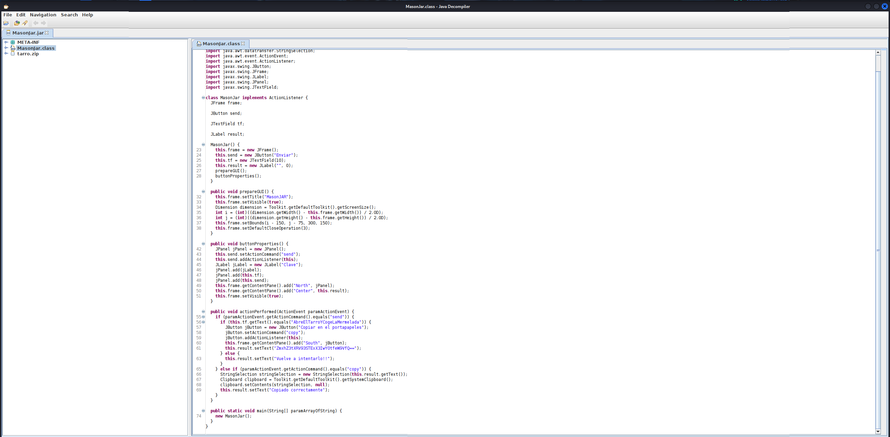
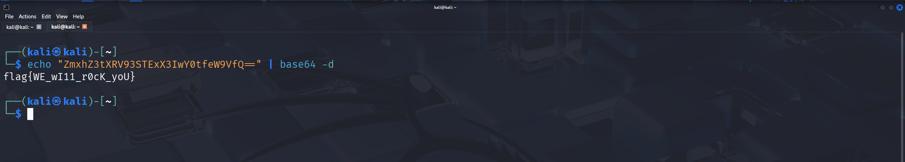
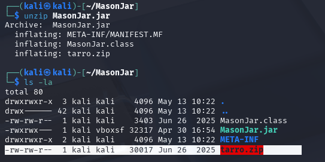
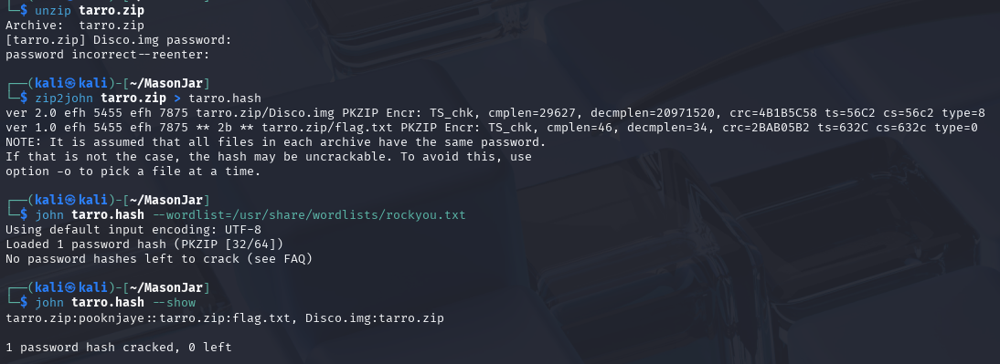
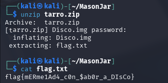
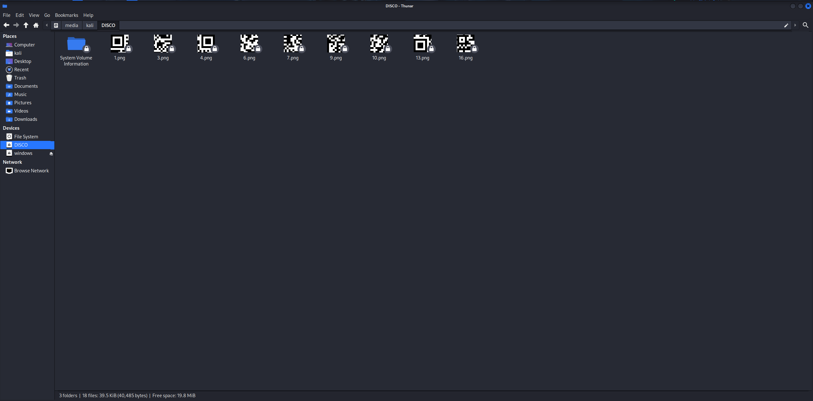
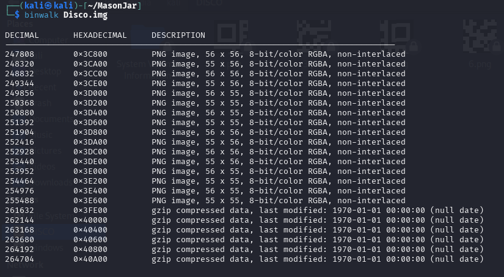
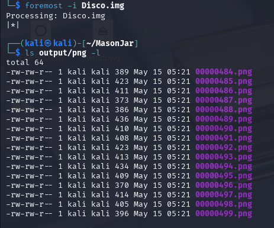
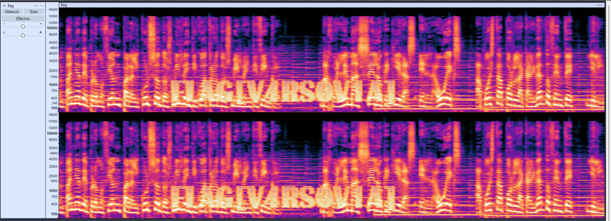

**Category:** Misc

# Mason Jar - Parte 1

*Nuestro equipo de inteligencia ha interceptado un archivo sospechoso llamado MasonJar.jar. A simple vista, parece una aplicación inofensiva que requiere una clave para entrar, pero el creador no nos ha proporcionado el acceso.*

*¿Cuál es la flag que se muestra tras introducir la contraseña correcta en el ejecutable Java?*

**Provided resources:**
- JAR file `MasonJar.jar`

---

## Solution

### Static Analysis

Since the challenge provided a Java executable (`.jar`), the first step was to inspect its contents before executing it.  

JAR files can be decompiled using tools such as `jd-gui`, allowing recovery of the original Java source code and enabling static analysis of the application logic.

The decompiled code revealed a simple authentication flow: the application displays a graphical interface containing an input field and a button.  
  
When the hardcoded string: "AbreElTarroYCogeLaMermelada" is submitted, the program reveals a Base64-encoded value.

This indicates that the application does not implement any real authentication mechanism, but instead relies on client-side validation with a **hardcoded** password.

### Flag recovery

The resulting Base64 string was decoded using standard decoding utilities such as `base64`.

Decoding the value revealed the final flag.

This challenge highlights the risks of relying on client-side validation and hardcoded secrets within distributed applications, as static analysis can easily expose sensitive logic and embedded credentials.

# Mason Jar - Parte 2

**Challenge context:** The challenge continues the analysis of a Java application that contains embedded resources, including an additional compressed archive requiring further extraction.

---

## Solution

Static analysis of `MasonJar.jar` revealed an embedded archive named `tarro.zip`, which was extracted using standard decompression tools such as `unzip`.

Upon extraction, the ZIP archive was found to be password-protected, preventing direct access to its contents.  

To recover the password, the ZIP file was converted into a crackable hash format and attacked using a dictionary-based approach with `john the ripper`. This method attempts to match password candidates against the extracted hash using a predefined wordlist.  

Given the common weakness of user-defined ZIP passwords, a dictionary attack was sufficient to recover the correct passphrase.

Once the correct password was obtained, the archive was successfully decompressed, revealing a `flag.txt` file containing the final flag.

This highlights the weakness of relying on password-protected ZIP files as a security mechanism, as they can be trivially brute-forced when weak credentials are used.

# Mason Jar - Parte 3

**Challenge context:** After unzipping the file inside `MasonJar.jar`, the task is to find a flag in a video inside the `Disco.img` file.

## Solution

After mounting the disk image, nine PNG fragments of a QR code were discovered. The fragments were numbered from 1 to 16, indicating that several pieces were missing or had been removed.

Further inspection of the disk image using `binwalk` revealed additional embedded PNG fragments not visible through standard filesystem inspection.

To recover deleted content from the disk image, a forensic recovery tool such as `foremost` was used. This utility allows extraction of files that are no longer directly accessible through the filesystem by carving data from the raw disk image.

The recovered fragments completed the missing sections of the QR code. Once the fragments were reconstructed according to their numbering sequence, the QR redirected to a cloud-hosted video file.  

According to the original challenge context, the flag was expected to be hidden within the video itself. However, initial inspection did not reveal any visible flag or explicit clue in the visual content.  

Closer analysis revealed a segment containing distorted audio artifacts **between the 0:05 and 0:09 marks**, suggesting that the relevant information is embedded within the audio track rather than directly visible in the video content.

This observation led to further analysis of the audio signal using spectrogram visualization techniques.

Spectrogram analysis revealed the hidden flag embedded within the audio signal, completing the final stage of the challenge.

This challenge emphasizes how improperly deleted data can still be recovered through forensic techniques, highlighting the importance of secure data sanitization and storage handling practices.