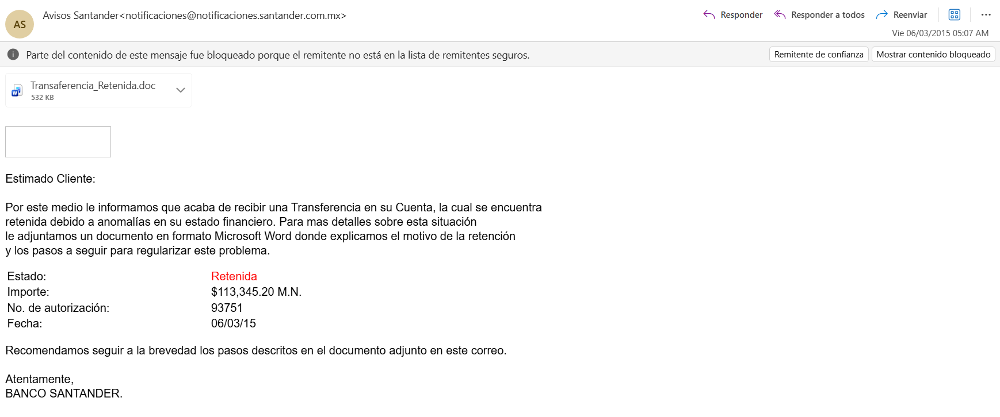
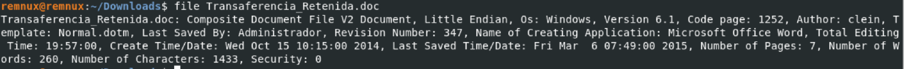
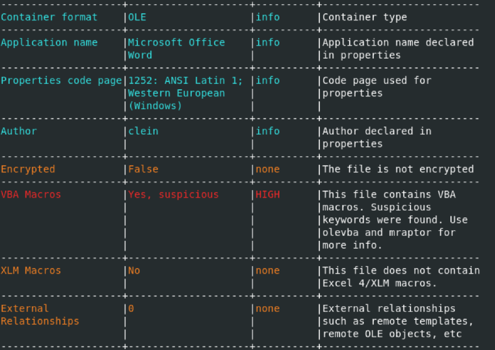
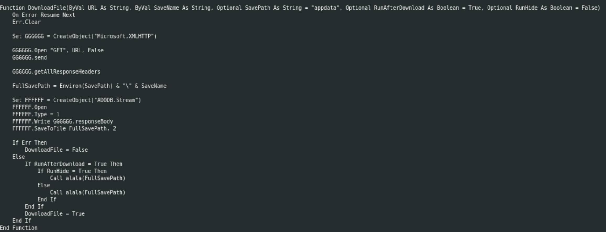
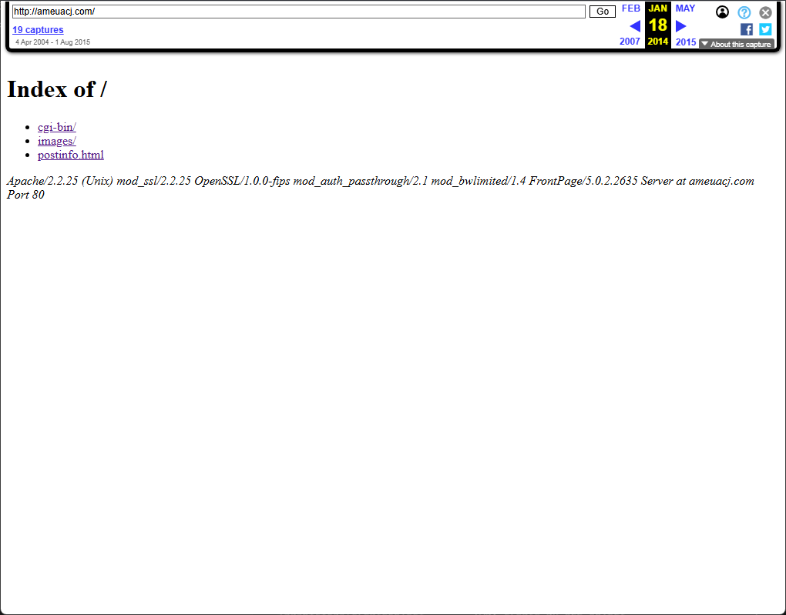

# Executive Summary

This report documents the investigation of a malicious Microsoft Word document received via email.

The sample was specifically crafted to execute hidden instructions when opened by a victim, with the objective of downloading additional malicious software from an external server. While the original payload was no longer available at the time of analysis, investigation of the associated infrastructure provided valuable insight into how the attack was designed to operate.

The evidence collected during the investigation allowed reconstruction of the infection chain and identification of several indicators commonly associated with phishing campaigns and malware distribution operations.

Attacks of this nature are frequently used to steal sensitive information, harvest credentials, facilitate financial fraud, or establish unauthorized access to corporate systems. Understanding how these campaigns operate is essential for improving security awareness and reducing the risk posed by malicious email attachments.

# Objectives

The objective of this investigation is to analyze the sample received via email and determine its potential security impact.

The investigation aims to:

- Identify the techniques used to deliver and execute malicious content
- Reconstruct the infection chain associated with the document
- Investigate the infrastructure involved in the distribution of the malware
- Assess the potential risks posed to affected users and organizations
- Collect indicators of compromise (IOCs) that may assist in future detection and prevention efforts

# Scope

This investigation focuses on the analysis of the sample and the infrastructure associated with its distribution and execution chain.

The scope of the analysis includes:

- Static analysis of the Microsoft Word document and its embedded content
- Examination of VBA macros and associated execution logic
- Identification of network indicators and external resources referenced by the document
- Investigation of the email and server infrastructure involved in the delivery of the malicious file
- Investigation of the infrastructure used to host the second-stage payload
- Collection and documentation of Indicators of Compromise (IOCs) derived from the analyzed artifacts

The investigation does not include dynamic execution of the second-stage payload, as the original executable was no longer available from the referenced infrastructure at the time of analysis.

# Analysis Limitations

This investigation is limited by the unavailability of the second-stage payload, which was originally hosted on a remote server that is no longer accessible at the time of analysis.

As a result, conclusions regarding post-execution behavior are derived from static analysis of the document and supporting external threat intelligence sources, rather than direct observation of the payload execution.

# Investigation
## Initial Infection Vector

The infection began with a phishing email containing a Microsoft Word document as an attachment.

The email leverages a financial pretext by impersonating a banking institution and reporting a supposed blocked transaction. The content is designed to create a sense of urgency and legitimacy by referencing a specific monetary amount and transaction details, encouraging the recipient to open the attached document to resolve the issue.



*Figure 1: Phishing email impersonating a banking institution.*

No additional attachments or external links were present, indicating that the document itself served as the primary execution vector.

Although the email appears to originate from a legitimate banking institution, analysis suggests that the sender identity is likely spoofed, a common technique used in phishing campaigns to increase trust and improve the likelihood of user interaction with malicious attachments.

### Email Header Analysis

Technical analysis of the email headers revealed a significant discrepancy between the sender identity presented to the recipient and the infrastructure actually involved in message delivery.

The message was presented as a banking notification using the following sender information:

- **Displayed Sender:** `Avisos Santander <notificaciones@notificaciones.santander.com.mx>`
- **Subject:** `Transferencia retenida en su cuenta`
- **Date:** `Fri, 6 Mar 2015 12:06:52 +0100`
- **Recipients:** `undisclosed-recipients:;`

The use of `undisclosed-recipients` suggests that the message was distributed as part of a bulk email campaign rather than being directed at a specific individual, a common characteristic of large-scale phishing operations.

Analysis of the `Received` headers allows reconstruction of the message delivery path.

The earliest identifiable source in the header chain corresponds to the IP address `5.79.64.197`, which connected to the mail server `mail.[REDACTED].gob.mx`. The message was subsequently relayed through this infrastructure and delivered to the recipient's email provider.

The observed delivery path is summarized below:

```text
5.79.64.197
        │
        ▼
mail.[REDACTED].gob.mx
        │
        ▼
Recipient Mail Provider
```

Although the email claimed to originate from Santander, the delivery infrastructure identified in the header chain is unrelated to the financial institution. This inconsistency strongly suggests that the visible sender address cannot be considered a reliable indicator of the message's true origin.

Further examination of the authentication results revealed the absence of common sender verification mechanisms:

|Security Control|Result|
|---|---|
|SPF|None|
|DKIM|None|
|DMARC|Not observed|

The lack of SPF and DKIM validation means that no cryptographic or policy-based verification was available to confirm that the message was legitimately authorized by the domain it purported to represent.

## Attached Document

The email contained a Microsoft Word document attachment encoded as a binary file:

- **Filename:** `Transaferencia_Retenida.doc`
- **Content-Type:** `application/octet-stream`
- **File Format:** Microsoft Office Word (OLE Compound File)

Given the social engineering theme presented in the email, the attachment serves as the primary infection vector. Subsequent analysis of the document confirmed the presence of embedded VBA macros implementing a downloader-based execution chain designed to retrieve and execute an external payload.

### Metadata Analysis

| Filename             | Transaferencia_Retenida.doc                                      |
| -------------------- | ---------------------------------------------------------------- |
| File Hashes (SHA256) | 57770e507b76b286428c78cccd94900c03b0fc12e27f29a52f996a8722faee58 |
| File Hashes (MD5)    | bda3ec32d6604d6049c921967f880720                                 |

Initial inspection confirmed that the file is a legacy Microsoft Office Word document utilizing the Structured Storage (OLE) format.



*Figure 2: File type verification confirming Microsoft Office OLE format*

Metadata inspection revealed standard Office properties with no encryption or macro restrictions, indicating that embedded code execution was not blocked at the file level. To triage potential malicious indicators, the file was analyzed using `oleid`, which flagged the presence of VBA macros as highly suspicious based on known behavioral heuristics.



*Figure 3: Oleid output highlighting suspicious VBA macro presence.*

### Macro Execution Chain

Deeper inspection using `olevba` confirmed a classic downloader-style execution flow. The macro structure avoids complex obfuscation, relying instead on junk comments (`'jkldljkl...`) to alter file hashes.

The document defines multiple auto-execution entry points to ensure execution across different Office environments and user behaviors:

- `AutoOpen` / `Auto_Open`: Triggers when the Word document is opened.
- `Workbook_Open`: Typically used in Excel, included here likely as a redundancy measure or artifact of a multi-purpose builder.

The malicious code sequence operates through two primary functions designed to execute a download-and-execute sequence:

1. **Ingress and Payload Delivery (`DownloadFile`):** The routine instantiates the `Microsoft.XMLHTTP` COM object to perform a synchronous HTTP GET request targeting a hardcoded remote infrastructure.

	-  **Target URL:** `http://www.ameuacj.com/images/ws/<removed>.exe`
    - If successful, the response is written to disk via an `ADODB.Stream` object in binary mode and stored in `%APPDATA%\e3e3e3.exe`.



*Figure 4: DownloadFile function behavior*

2. **Host Evasion and Anti-Analysis (`alala`):** Once the second-stage binary is dropped, the `alala` routine invokes the native Windows `Shell` function under `vbNormalFocus` to initiate the process. Immediately following execution, the macro implements a defense evasion mechanism:
    
    - It forces a visual error prompt using `MsgBox`: _"Este documento no es compatible con este equipo. Por favor intente desde otro equipo."_
    - It systematically disables application alerts (`Application.DisplayAlerts = False`) and commands the immediate termination of the parent process (`Application.Quit`).
    
*Strategic Intent:* This sequence simulates a compatibility failure to mask the asynchronous background activity of the newly spawned child process (`e3e3e3.exe`) and quickly terminates the primary analysis environment (Microsoft Word).

While the VBA implementation contains several helper routines, the overall execution flow can be summarized as follows:

```text
Document Open
    │
    ▼
AutoOpen / Auto_Open
    │
    ▼
DownloadFile()
    │
    ├── HTTP GET → remote C2 infrastructure
    ├── Write binary → %APPDATA%\e3e3e3.exe
    │
    ▼
alala()
    │
    ├── Execute payload (Shell)
    ├── Fake compatibility error (MsgBox)
    └── Terminate Word process
```

From the user's perspective, the document appears to fail due to a compatibility issue and immediately closes. This behavior serves as a simple deception mechanism, reducing suspicion while the downloaded payload executes in the background.

## Vendor Classification

Cross-referencing the static behavioral indicators against threat intelligence databases matches the signature family **TrojanDownloader:W97M/Donoff**, as classified by Microsoft Defender [[1]](#ref-1).

> **Note:** This correlation serves as contextual threat intelligence to evaluate the campaign's lineage. Given the lack of a live second-stage binary, it should not be interpreted as a definitive assessment of the campaign's ultimate intent.

The structural match with the *Donoff* family relies on the following aligned criteria:

- The abuse of automated Office entry points to bypass manual user interaction.
- The utilization of native scripting interfaces (`XMLHTTP` / `ADODB.Stream`) to circumvent network enforcement rules.
- Dropping binaries into volatile, low-privilege directories (`%APPDATA%`).

## Potential Payload Insights

According to historical threat telemetry documented in the Microsoft Security Intelligence encyclopedia for the *Donoff* family, this downloader functions strictly as a delivery vehicle for commodity or targeted malware. Based on established family variants, an active infrastructure state typically leads to the dropping and execution of the following threats [[1]](#ref-1).:

- **Backdoors:** `Backdoor:Win32/Fynloski.A` / `Backdoor:Win32/Vawtrak` (Facilitating remote access and continuous host control).
- **Ransomware:** `Ransom:MSIL/Swappa.A` / `Ransom:Win32/Teerac.A` (Targeting local data encryption and operational disruption).
- **Trojan Downloaders / Information Stealers:** `TrojanDownloader:Win32/Drixed.A` (Specialized in harvesting credentials and financial data).
- **Worms:** `Worm:Win32/Gamarue` (Enabling lateral movement across the internal network infrastructure).

## Payload Hosting Infrastructure Analysis

The VBA macro identified during static analysis attempted to retrieve a second-stage executable from the following location:

`http://ameuacj.com/images/ws/<removed>.exe`

At the time of analysis, the original infrastructure was no longer accessible, preventing direct retrieval or dynamic execution of the binary. As a result, the investigation of this component is based on historical web archives and domain intelligence data.

Historical domain records indicate that the website belonged to the **Asociación de Médicos de la Universidad Autónoma de Ciudad Juárez (AMEUACJ)** and had been publicly accessible since at least 2004.

Throughout its operational life, the service was exposed exclusively over **HTTP**, with no evidence of HTTPS certificate deployment at any point in time. This absence of transport-layer encryption is consistent with legacy web hosting practices commonly observed in early-2000s institutional websites.

No definitive evidence was found to determine when the server may have been compromised. However, archived snapshots available through the Internet Archive provide useful context regarding the structure of the website during the period surrounding the phishing campaign.

A snapshot dated **18 January 2014** shows that the directory structure contained an `images/` path, which is particularly relevant given that the malware attempted to retrieve its payload from a subdirectory within that location.



*Figure 5: Status of payload hosting at January 18th 2014*

Although the directory names are visible in the archive, the underlying contents are no longer accessible and could not be recovered for analysis.

Subsequent snapshots indicate changes in site availability:

- By **17 May 2014**, the website appears to have been restored, suggesting maintenance activity or partial remediation of prior configuration issues.
- The phishing campaign associated with the analyzed document is dated **March 2015**, which places it within a period where the infrastructure was still operational or intermittently maintained.

Given this timeline, it is plausible that the infrastructure was either:

- Compromised during its active phase, or
- Repurposed without the original administrators’ awareness

A final available snapshot of the homepage dated **1 August 2015** shows a non-functional or blank page, with no active content being served. This behavior is commonly associated with abandoned or partially decommissioned websites.

# Indicators of Compromise (IOCs)

The following indicators were extracted during the investigation and may assist in identifying related activity, detecting compromised systems, or correlating similar phishing campaigns.

| Type                         | Value                                                              |
| ---------------------------- | ------------------------------------------------------------------ |
| Filename                     | `Transaferencia_Retenida.doc`                                      |
| MD5                          | `bda3ec32d6604d6049c921967f880720`                                 |
| SHA256                       | `57770e507b76b286428c78cccd94900c03b0fc12e27f29a52f996a8722faee58` |
| Microsoft Defender Detection | `TrojanDownloader:O97M/Donoff`                                     |
| URL                          | `ameuacj.com/images/ws/[REDACTED].exe`                             |
| Executable file name         | `e3e3e3.exe`                                                       |

# Conclusions

The investigation confirmed that the analyzed Microsoft Word document was intentionally crafted to function as the initial stage of a malware delivery campaign.

Analysis of the embedded VBA macros revealed a downloader mechanism designed to retrieve and execute a second-stage payload from a remote server while presenting the victim with a deceptive error message intended to conceal the malicious activity. This behavior is consistent with the classification assigned by Microsoft Defender (`TrojanDownloader:O97M/Donoff`) and with common techniques observed in phishing-based malware campaigns.

Although the second-stage payload was no longer accessible at the time of analysis, the available evidence was sufficient to reconstruct the infection chain, identify the infrastructure involved, and document multiple indicators of compromise associated with the campaign.

The investigation also demonstrated how phishing operations frequently rely on social engineering rather than technical sophistication alone. The email leveraged the reputation of a trusted financial institution, combined with a fabricated financial alert, to encourage user interaction with the malicious attachment. However, examination of the message headers and document contents revealed clear indicators of impersonation and malicious intent.

Analysis of the payload-hosting infrastructure further highlighted that malicious content is not always distributed from obviously malicious servers. In this case, the downloader attempted to retrieve its payload from a legitimate third-party website that appears to have been compromised, illustrating how attackers often abuse vulnerable or poorly maintained systems to host malware and evade detection.

Overall, the findings reinforce the importance of cautious handling of unsolicited email attachments, verification of sender authenticity, and the use of controlled analysis environments when investigating potentially malicious files. Even when portions of the original evidence are no longer available, systematic forensic analysis can provide valuable insight into attack methodologies, infrastructure abuse, and potential risks to users and organizations.

# References
<a id="ref-1"></a>[1] Microsoft Security Intelligence, "Malware Encyclopedia - Threat Description: TrojanDownloader:W97M/Donoff," _Microsoft Threat Encyclopedia_, Mar. 2017. [Online]. Available: [https://www.microsoft.com/en-us/wdsi/threats/malware-encyclopedia-description?Name=TrojanDownloader:W97M/Donoff](https://www.microsoft.com/en-us/wdsi/threats/malware-encyclopedia-description?Name=TrojanDownloader:W97M/Donoff)


