# Overview

**Target**:  [Editor](https://app.hackthebox.com/machines/Editor)

**Difficulty:** Easy

<details>  
<summary>⚠️ Quick summary (spoiler)</summary>  
  
This machine involves exploiting an unauthenticated RCE in XWiki followed by privilege escalation via a misconfigured SUID binary.
  
</details>

# Reconnaissance

As a first step, I performed network reconnaissance using `nmap` to identify exposed services and potential attack vectors.

```bash
nmap -sV -sC -p- TARGET_IP
```

* `-sV` to determine service and version
* `-sC` to run the default script scan (useful to identify attack vectors)
* `-p-` to scan all TCP ports

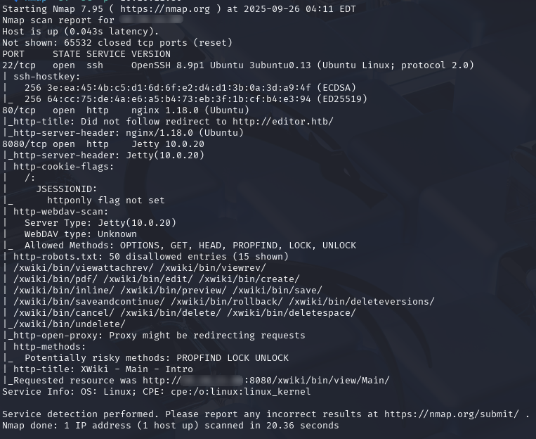

The scan revealed an HTTP service running on port 80, backed by `Jetty 10.0.20`, which redirected to `http://editor.htb/`.

The presence of Jetty suggests a Java-based web application, which is often associated with frameworks that may expose version information or known vulnerabilities through their web interface. This made the web application the primary target for further analysis.

# Web Enumeration

Once added the domain to `hosts`, I was able to access `http://editor.htb`.


Navigating to the **"Docs"** section from the main menu redirects the user to a `XWiki` instance. Upon inspection of the page footer, the specific software version was identified as `XWiki Debian 15.10.8`.

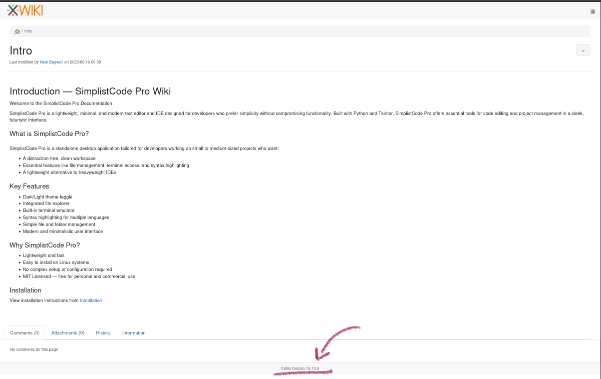

`XWiki` is an open-source platform commonly used for knowledge bases, intranets, and collaborative documentation, featuring a WYSIWYG editor and dynamic content rendering.  
  
Identifying the exact version is particularly valuable, as web applications like `XWiki` often have publicly documented vulnerabilities. This makes version enumeration a critical step, since it allows mapping the target to known CVEs and potential exploitation paths.
# Initial Access

## Vulnerability Analysis  
  
Further investigation revealed that `XWiki 15.10.8` is vulnerable to [CVE-2025-24893](https://nvd.nist.gov/vuln/detail/CVE-2025-24893), which allows unauthenticated users to achieve remote code execution via the `SolrSearch` endpoint.  

The root cause lies in improper input validation of the `text` parameter. This parameter is used to construct and execute a query against the application's search backend.  

When the request includes `media=rss`, the value of the `text` parameter is embedded directly into the generated RSS feed (specifically within the title and description fields). Due to insufficient sanitization, **this allows injection of malicious payloads that are processed and executed by the server.**
  
In this context, `Solr` refers to the search engine used by `XWiki` to index and retrieve content. The vulnerability arises from how user-controlled input is incorporated into Solr query results and subsequently rendered.  
  
This behavior effectively turns a search feature into a code execution vector, enabling attackers to execute arbitrary commands without authentication.  

## Exploitation  
  
Based on the vendor advisory, the exploit consists of crafting a malicious request to the `SolrSearch` endpoint, injecting a payload through the `text` parameter.  
  
Rather than blindly executing a public exploit, understanding how the payload is reflected and processed is key to reliably triggering the vulnerability.

### Exploit analysis

A public [POC exploit](https://github.com/dollarboysushil/CVE-2025-24893-XWiki-Unauthenticated-RCE-Exploit-POC?tab=readme-ov-file) was used to trigger the vulnerability. This script crafts a malicious request to the `SolrSearch` endpoint, injecting a payload through the `text` parameter.

As previously described, when `media=rss` is used, the injected payload is embedded into the generated RSS feed. Due to insufficient input sanitization, this content is processed server-side, ultimately leading to arbitrary command execution.

The exploit ultimately triggers a reverse shell by instructing the target to initiate a connection back to the attacker's machine.

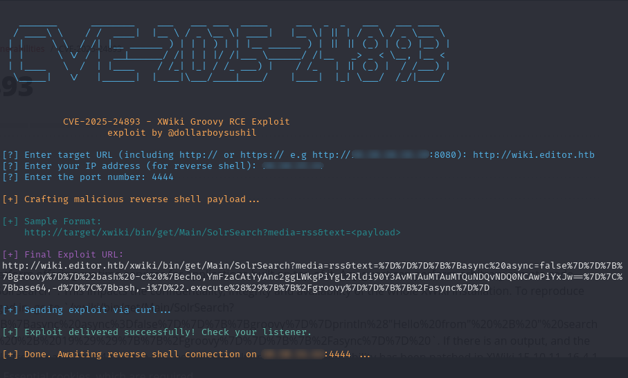

To adapt the exploit to the lab environment, the target URL and callback parameters were set accordingly. A listener was configured on the attacker's machine to receive the incoming connection.

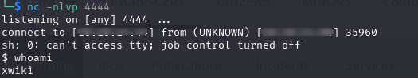

## Shell stabilization

After obtaining an initial reverse shell, the environment was limited and lacked full TTY functionality, which restricted usability (e.g., command editing, job control, and proper signal handling).  

To improve the interaction with the shell, I spawned a proper TTY using:

```bash
script /dev/null -c bash
```

This technique creates a more stable and interactive shell session, allowing better control over the compromised system and improving usability for further enumeration and privilege escalation tasks.

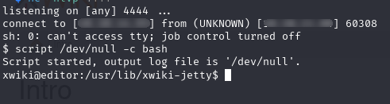

# User pivoting

After gaining initial access as the `xwiki` user, I was able to enumerate the system and identify additional local users by inspecting the `/home` directory.  

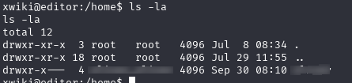

This step revealed the presence of another valid system user, which became relevant later in the attack chain.  
  
During further enumeration, I accessed the `hibernate.cfg.xml` configuration file, which exposed database credentials used by the application.

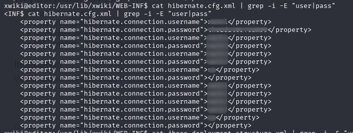

At this point, an important observation was made: the credentials stored in the configuration file appeared to be reused from a local system user account.  
  
This indicated weak credential hygiene, where the same password was used both for system authentication and database access.  
  
By correlating the discovered username from `/home` with the reused credentials found in the configuration file, it was possible to authenticate as the user on the system, achieving a successful pivot from the initial `xwiki` context.

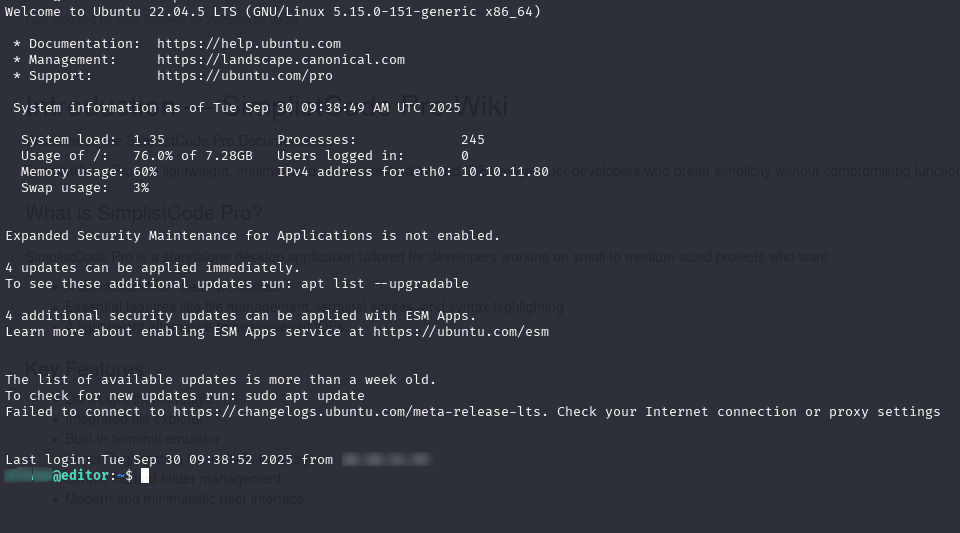

With access to the user account achieved, the user flag was successfully retrieved from the corresponding home directory, completing the initial objective of the machine.


# Privilege escalation

After obtaining user-level access, enumeration of the system was performed to identify potential privilege escalation vectors.  

## SUID Enumeration  

During system enumeration, binaries with SUID permissions were identified as potential privilege escalation vectors.  

SUID (Set User ID) is a Linux permission that allows a file to be executed with the privileges of its owner. When a binary owned by `root` has the SUID bit set, any vulnerability within that binary can potentially be abused to execute commands with elevated privileges.  

To identify such binaries, the following command was executed:

```bash
find / -type f -perm -04000 -ls 2>/dev/null
```

This revealed multiple unusual binaries associated with **Netdata**, a real-time system monitoring tool.

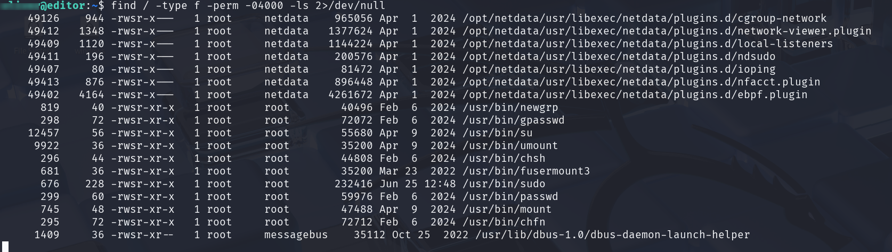

Netdata is commonly used to monitor system performance metrics such as CPU usage, disk activity, and network traffic. However, when improperly configured or running outdated versions, it can introduce privilege escalation risks.

## Exploitation

The installed version of Netdata was found to be affected by  [CVE-2024-32019](https://nvd.nist.gov/vuln/detail/CVE-2024-32019), which allows execution of arbitrary commands with elevated privileges.  
  
In this scenario, the Netdata binary is owned by `root` and has the SUID bit set, meaning any exploitable behavior within the service can be leveraged to escalate privileges directly to the highest level on the system.  
  
A public [proof-of-concept exploit](https://github.com/AliElKhatteb/CVE-2024-32019-POC) was used to leverage this vulnerability.
  
The exploit abuses Netdata’s execution context to trigger arbitrary command execution, resulting in a root-level shell.
 
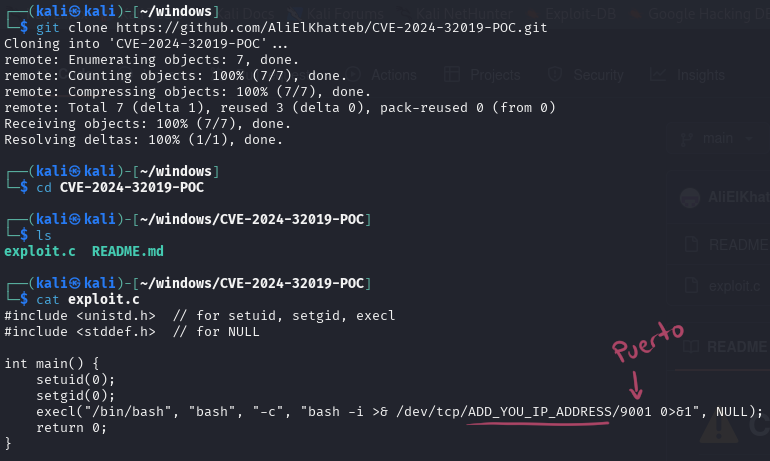

The exploit was compiled locally and transferred to the target system via `scp`.

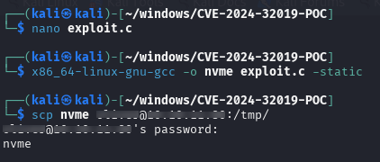

A listener was configured on the attacker machine, and upon execution, a reverse shell was successfully obtained with root privileges.

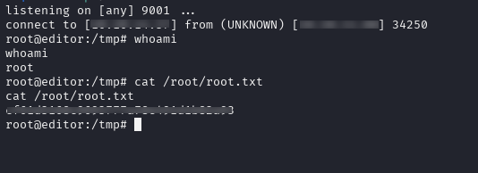

With administrative access achieved, the final flag located in `/root/root.txt` was retrieved, fully compromising the system.

# Conclusion

This machine demonstrated how multiple low-complexity issues can be chained together to achieve full system compromise. Starting from an unauthenticated remote code execution vulnerability in a web application, followed by credential exposure and privilege misconfigurations, the attack path ultimately led to root-level access.

The exercise highlights the importance of secure configuration practices and proper input validation across all layers of an application.

# Real-World Impact

If exploited in a real-world environment, this attack chain could have severe consequences:

- Full remote compromise of the application server without authentication
- Exposure of sensitive application and database data
- Unauthorized access to system-level user accounts due to credential reuse
- Complete system takeover via privilege escalation

This demonstrates how a single initial vulnerability, when combined with misconfigurations, can escalate into full infrastructure compromise.

# Mitigation

To reduce the risk of similar attacks, the following measures should be implemented:

- **Patch management:** Update `XWiki` to a version that fixes CVE-2025-24893
- **Input validation:** Ensure proper sanitization of user-controlled parameters in all endpoints
- **Credential hygiene:** Avoid reusing credentials across system services and application configurations
- **Least privilege principle:** Restrict SUID binaries and audit unnecessary elevated permissions
- **Service hardening:** Regularly review and secure monitoring tools such as Netdata

Proper implementation of these controls significantly reduces the attack surface and prevents full system compromise from a single initial entry point.