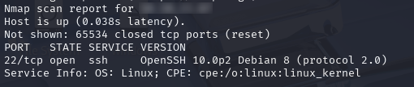
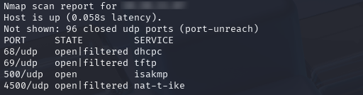
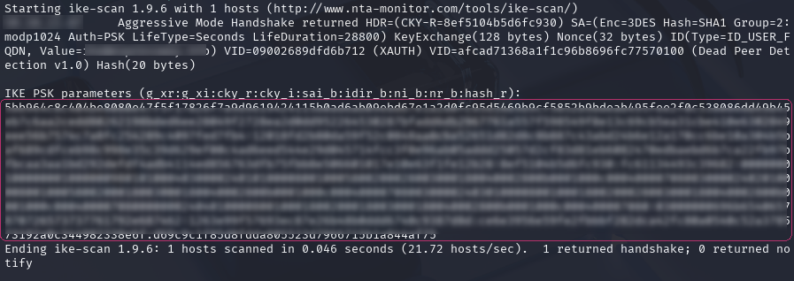
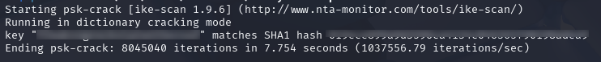
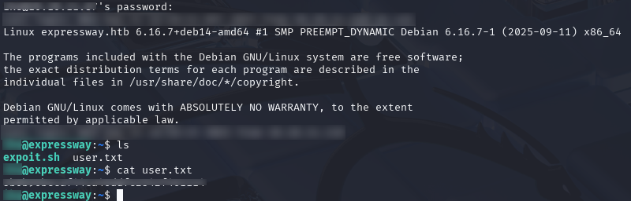
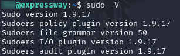
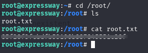

# Overview

**Target**:  [Expressway](https://app.hackthebox.com/machines/736)

**Difficulty:** Easy

<details>  
<summary>⚠️ Quick summary (spoiler)</summary>  
  
Exploitation of an exposed ISAKMP service allowed extraction of VPN authentication material via aggressive mode. The recovered credentials were reused for SSH access, enabling initial compromise. Privilege escalation was achieved through a vulnerable sudo version, resulting in root access.
  
</details>

# Reconnaissance

As a first step, network reconnaissance was performed using `nmap` to identify exposed services and potential attack vectors.

```bash
nmap -sV -sC -p- TARGET_IP
```

* `-sV` → service and version detection
* `-sC` → run the default script scan (useful to identify attack vectors)
* `-p-` → scan all TCP ports

The scan only revealed an OpenSSH service. No known vulnerabilities were identified for the detected version, and no additional TCP services were exposed.



Since no exploitable services were identified via TCP scanning, further reconnaissance was performed targeting UDP services.

By default, `nmap` prioritizes TCP scanning due to performance constraints, while UDP scans require significantly more time. For this reason, a limited scope UDP scan was executed:

```bash
sudo nmap -sU --top-ports 100 TARGET_IP
```

The UDP scan revealed port **500/UDP** open, which corresponds to **ISAKMP (Internet Security Association and Key Management Protocol)**.  



## ISAKMP enumeration

The UDP scan revealed port **500/UDP** open, corresponding to **ISAKMP (Internet Security Association and Key Management Protocol)**, commonly used in IPsec VPNs for negotiating security associations and authentication parameters.  
  
While not inherently vulnerable, exposed ISAKMP services can introduce attack vectors when misconfigured. In particular, configurations using **Aggressive Mode** may leak sufficient information to:  
  
- Enumerate valid identities  
- Capture handshake data for offline password cracking  
- Target weak pre-shared keys (PSK)  
  
Given these characteristics, the presence of ISAKMP suggests a potential VPN attack surface, making it a strong candidate for further enumeration.  
  
To interact with the service, `ike-scan` was used:

```bash
sudo ike-scan -A --pskcrack TARGET_IP
```

- `-A` → enables aggressive mode probing
- `--pskcrack` → captures handshake data suitable for offline PSK cracking



The scan revealed a valid identity along with a corresponding hash extracted from the ISAKMP handshake.

This confirms that the service is operating in **Aggressive Mode**, exposing material suitable for offline password attacks and significantly weakening the VPN security posture.
## PSK cracking

With the handshake data obtained from the ISAKMP service, the pre-shared key was recovered through offline dictionary attacks.

```bash
psk-crack -d /usr/share/wordlists/rockyou.txt psk.txt
```

The `psk-crack` tool was used against the captured hash using a commonly known wordlist (`rockyou.txt`), which contains weak and frequently reused passwords.



The attack was successful, revealing the valid pre-shared key.

This confirms that the VPN relied on a weak credential, making it susceptible to straightforward dictionary attacks once handshake data is exposed.
# Initial access

The recovered pre-shared key was tested against other services, confirming credential reuse across the system.

The same credentials were valid for SSH authentication, allowing direct access to the system.

```bash
ssh USER@TARGET_IP
```

This demonstrates poor credential hygiene, where the same password is reused across different services, significantly increasing the attack surface.



With SSH access established, the `user flag` was retrieved from the corresponding home directory, completing the initial objective.

# Privilege Escalation

After obtaining user-level access, further enumeration was performed to identify potential privilege escalation vectors.  
  
Even though the compromised user was not part of the `sudoers` group, the version of `sudo` installed on the system was inspected:

```bash
sudo -V
```



The output revealed a vulnerable version of `sudo`, affected by [CVE-2025-32462](https://nvd.nist.gov/vuln/detail/CVE-2025-32462).

This vulnerability allows local users to escalate privileges under certain conditions, even without direct `sudo` access.

The presence of this vulnerable version indicates that privilege escalation may be possible despite the apparent restrictions on the user account.

## Exploitation

To exploit the identified vulnerability, a [public proof-of-concept](https://www.exploit-db.com/exploits/52352) was leveraged, which abuses `sudo`'s interaction with the Name Service Switch (NSS) mechanism.  
  
The exploit works by creating a controlled environment using the `-R` (chroot) option in `sudo`, allowing the attacker to supply a malicious `nsswitch.conf` configuration. This configuration forces the system to load a custom NSS module during user resolution.  
  
A shared library was crafted to match the expected `libnss_*` format. This library contains a constructor function that is automatically executed when the module is loaded.  
  
When `sudo` attempts to resolve a user within the controlled environment, it loads the malicious NSS module. Since this process occurs with elevated privileges, the embedded payload is executed as `root`, resulting in a root shell.


This technique effectively bypasses standard privilege restrictions by exploiting how `sudo` handles dynamic library loading in conjunction with NSS, leading to full system compromise.



With administrative access achieved, the final flag located in `/root/root.txt` was retrieved.

# Conclusion

This assessment demonstrated how multiple low-complexity weaknesses can be chained to achieve full system compromise. The attack began with an exposed ISAKMP service, followed by weak VPN authentication practices, credential reuse, and ultimately privilege escalation through a vulnerable system binary.

Each step individually presents a moderate risk, but when combined, they result in a complete compromise of the target system.

# Real-World Impact

If present in a production environment, this attack chain could lead to:

- Unauthorized access to VPN-protected infrastructure  
- Exposure of valid user credentials through handshake capture  
- Lateral movement via credential reuse across services  
- Full system compromise through privilege escalation  

This highlights how weaknesses in authentication mechanisms and system hardening can escalate from initial access to total infrastructure compromise.

# Mitigation

To reduce the risk of similar attack chains, the following security measures should be implemented:

- Disable ISAKMP Aggressive Mode and enforce secure VPN configuration (Main Mode where applicable)  
- Use strong, unique pre-shared keys and avoid weak or dictionary-based credentials  
- Implement proper credential separation between services (no reuse across systems)  
- Regularly patch system components, including `sudo` and other privileged binaries  
- Minimize unnecessary exposure of authentication services on public interfaces  
- Conduct periodic security audits of VPN and privilege escalation vectors  