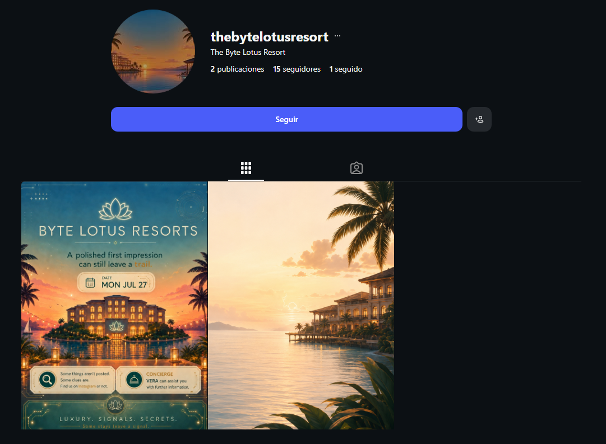
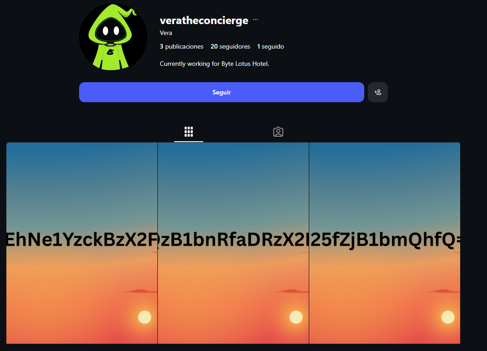

# Overview

**Target**:  [The Brochure](https://tryhackme.com/room/hh-thebrochure-081f3e36)

**Difficulty:** Easy

<details>  
<summary>⚠️ Quick summary (spoiler)</summary>  
  
The objective of this OSINT challenge was to recover a hidden flag by analyzing publicly available information on social media.
  
</details>

# Initial Analysis

The only artifact provided was the following promotional 


Several elements immediately stood out:

* The organization name is **Byte Lotus Resorts**
* An explicit reference to **Instagram**
* A mention of an individual named **Vera**, suggesting that additional information could be obtained through this person.

These clues indicated that the investigation should begin by locating the hotel's social media presence.

# Social Media Reconnaissance

Searching Instagram for **Byte Lotus Resorts** led to an account matching the organization referenced in the flyer.



The profile, published posts, comments, and biography were thoroughly reviewed in search of hidden messages, unusual metadata, or direct references to the challenge.

No flag or immediately useful information was identified.

Since the profile itself did not contain the solution, attention shifted to the remaining clue provided in the flyer: *"VERA can assist you with further information."*

The wording suggested that **Vera** was likely another Instagram account connected to the hotel.

Rather than performing a broad search, the hotel's social graph was inspected by reviewing the accounts it followed.

Among them, an account belonging to **Vera** was identified. 



Inspection of Vera's profile revealed three seemingly unrelated posts, which individually, none of them revealed meaningful information.

However, the numbering strongly suggested that they represented fragments of a single encoded message.

# Decoding the Message

The final fragment terminated with the characters `==`, a common padding sequence used in Base64 encoding.

This observation indicated that the three strings should first be concatenated in numerical order before attempting any decoding.

```
VEh...mQhfQ==
```

Decoding the resulting Base64 string successfully recovered the challenge flag.

## Conclusion

This challenge demonstrates a common principle in OSINT investigations: valuable information is often distributed across multiple public sources rather than exposed in a single location.

Instead of relying on technical exploitation, the solution required careful interpretation of contextual clues, navigation through social relationships, and recognition of common encoding patterns.

Although technically simple, the challenge reinforces the importance of structured reasoning and attention to detail when conducting investigations using publicly available information.