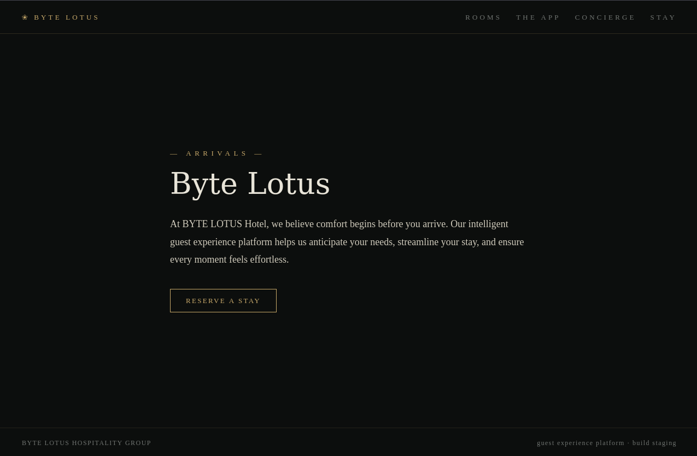
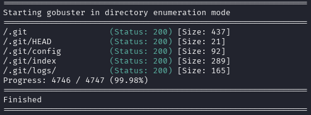
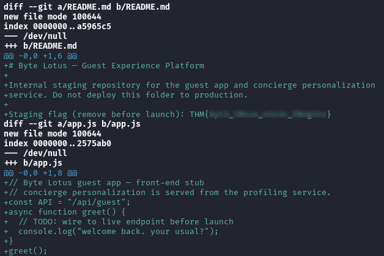

# Overview

**Target**:  [Room 404](https://tryhackme.com/room/hh-room404-804573bf)

**Difficulty:** Easy

<details>  
<summary>⚠️ Quick summary (spoiler)</summary>  
  
The objective of this challenge was to recover a flag from an exposed web application.
  
</details>

# Reconnaissance

The target application was accessible through port **8080**, serving a simple static webpage.



The interface contained a single interactive element that redirected the user to the `/booking` endpoint. However, this endpoint did not exist and consistently returned an HTTP **404 Not Found** response.

At this stage, neither the webpage nor its client-side source code contained any obvious indicators, hidden comments, or sensitive information that could lead directly to the flag.

Since the visible attack surface was extremely limited, the next logical step was to enumerate hidden resources exposed by the web server.

## Web Ennumeration

Directory fuzzing was performed using **Gobuster** together with the common wordlist from SecLists.

```
gobuster dir \
-u http://MACHINE_IP:8080 \
-w /usr/share/seclists/Discovery/Web-Content/common.txt
```

The enumeration revealed several accessible paths belonging to a Git repository:



The presence of the `.git` directory exposed through the web server represents a common security misconfiguration.

Although these files are intended exclusively for local version control, exposing them publicly allows an attacker to reconstruct the entire repository, including source code, commit history, deleted files, configuration files, and occasionally secrets that developers believed had already been removed.

# Repository and Flag Recovery

Once the exposed repository had been identified, the next step was to recover its contents.

For this purpose, **git-dumper** was used to reconstruct the repository locally from the publicly accessible `.git` directory.

```
git-dumper http://MACHINE_IP:8080/.git recovered_repo
```

After the download completed successfully, the repository history was inspected using Git's native logging functionality.

```
cd recovered_repo

git log -p
```

Reviewing the commit history revealed the flag embedded within one of the recorded commits.



# Conclusion

This challenge demonstrates one of the most common deployment mistakes in web applications: publishing the `.git` directory alongside the production website.

While the application itself contained virtually no exploitable functionality, the exposed repository disclosed significantly more information than the running service.

Because Git stores the complete development history, attackers may recover:

- Source code.
- Previous application versions.
- Deleted files.
- Configuration files.
- API keys or credentials accidentally committed.
- Sensitive comments left during development.

In this case, the flag was not present in the application's visible content but was preserved within the repository history, illustrating how version-control metadata can become an unintended source of sensitive information when exposed publicly.