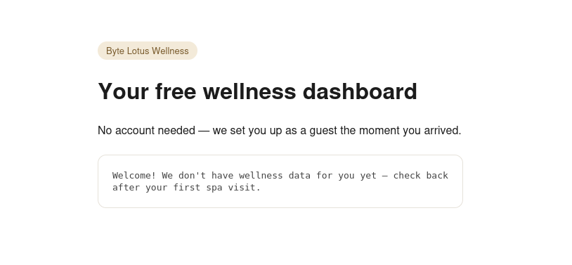
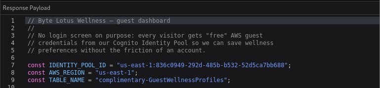
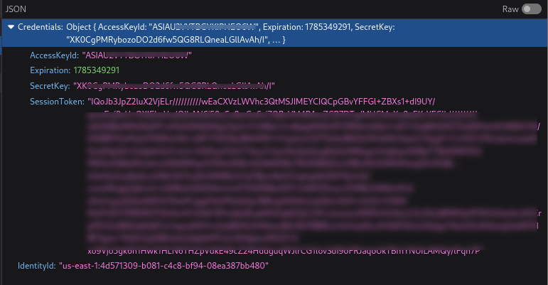
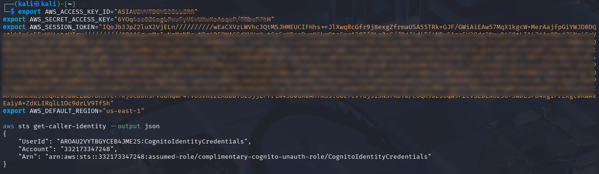
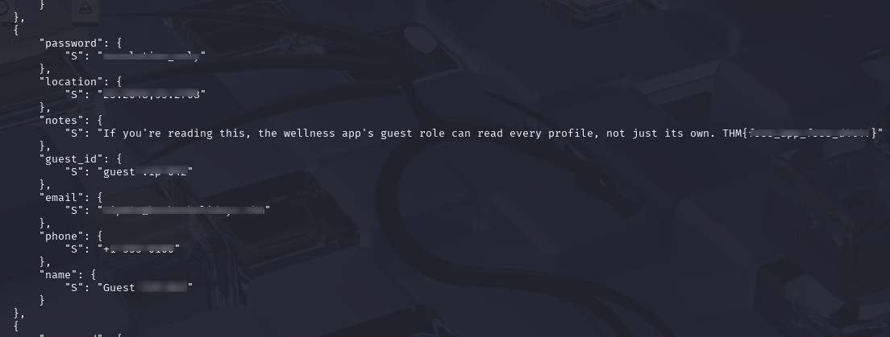

# Overview

**Target**:  [Complimentary](https://tryhackme.com/room/hh-complimentary-05e0b604)

**Difficulty:** Easy

<details>  
<summary>⚠️ Quick summary (spoiler)</summary>  
  
The target consisted of a static wellness application that personalized its content despite requiring no user registration or authentication. The goal was to identify how the application obtained user information, recover the temporary AWS credentials issued to anonymous visitors, and determine whether those credentials granted access beyond the intended dataset.
  
</details>

# Reconnaissance

The application was hosted at the following URL:

```
http://complimentary-wellness-app-332173347248.s3-website-us-east-1.amazonaws.com/
```

The URL structure immediately revealed that the application was being served from an **Amazon S3 static website**.

Because S3 static hosting does not execute server-side code, all application logic—including interactions with AWS services—must occur client-side. This makes JavaScript files and browser traffic valuable sources of information during reconnaissance.



Using the browser's Developer Tools, the application's JavaScript files were inspected.

Analysis of `app.js` revealed that the application relied on an **AWS Cognito Identity Pool** to obtain temporary credentials for anonymous users.



Among the exposed configuration values was the Cognito Identity Pool identifier:

```
us-east-1:836c0949-...
```

This indicated that visitors were automatically issued temporary AWS credentials without requiring authentication.

Further inspection of the **Network** tab confirmed this behavior.

When the application initialized, it performed a request to:

```
https://cognito-identity.amazonaws.com/
```

The response contained temporary AWS credentials, including:

- AccessKeyId
- SecretAccessKey
- SessionToken

These credentials were intended for the application's anonymous role and were automatically delivered to every visitor.



# Access

The captured credentials were exported as environment variables in a local terminal in order to interact directly with AWS services using the AWS CLI.

``` bash
export AWS_ACCESS_KEY_ID=<AccessKeyId>
export AWS_SECRET_ACCESS_KEY=<SecretAccessKey>
export AWS_SESSION_TOKEN=<SessionToken>
```

To verify that the credentials were valid, the following command was executed:

``` bash
aws sts get-caller-identity --output json
```

The successful response confirmed that the temporary credentials were active and associated with the anonymous IAM role assigned by Cognito.



The application interface only displayed information associated with the current guest profile.

This suggested that client-side logic restricted users to querying a single record from the backend, most likely using the DynamoDB **GetItem** operation.

However, client-side restrictions alone do not constitute access control.

Since valid AWS credentials had already been obtained, the next step was to evaluate the permissions granted to the anonymous IAM role directly.

Instead of requesting an individual record, a full table scan was attempted using the AWS CLI.

``` bash
aws dynamodb scan \
    --table-name complimentary-GuestWellnessProfiles \
    --output json
```

The request completed successfully.

This demonstrated that the IAM policy attached to the Cognito identity pool granted the anonymous role the **`dynamodb:Scan`** permission, allowing unrestricted enumeration of every item stored in the table.

This represents a classic example of **Broken Access Control**, where authorization decisions rely solely on client-side behavior while the backend grants excessive privileges.

# Flag

The scan operation returned every record stored within the DynamoDB table.

The retrieved dataset included multiple guest profiles together with application data that was never intended to be visible to anonymous users.

Among the exposed records was the challenge flag stored inside one guest's notes field.



# Conclusion

The vulnerability was not the use of AWS Cognito itself, but the permissions assigned to the anonymous IAM role.

The intended workflow restricted users to viewing only their own profile through the web interface. However, because the IAM policy authorized the **`dynamodb:Scan`** action, any anonymous visitor could bypass the application's frontend entirely and interact directly with DynamoDB using the AWS CLI.

This illustrates an important cloud security principle:

> Authentication determines _who you are_; authorization determines _what you can do_.

Although Cognito correctly identified anonymous users, the associated IAM policy granted significantly broader permissions than required, allowing complete database disclosure.

Following the **Principle of Least Privilege**, the anonymous role should only have been permitted to perform the minimum set of operations required by the application—ideally restricted to reading a single authorized record rather than scanning the entire table.