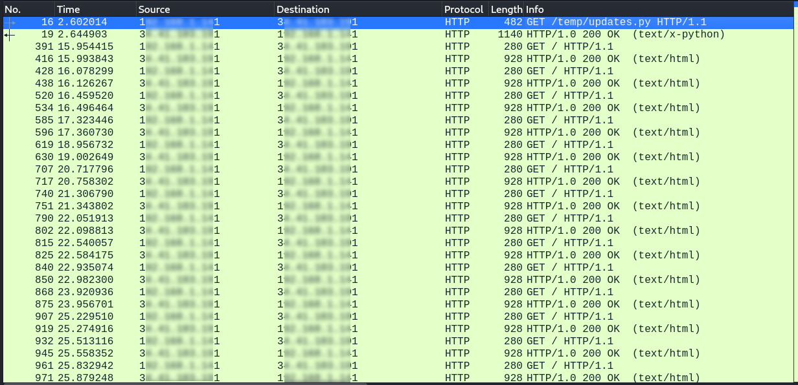
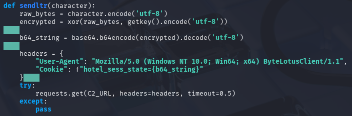
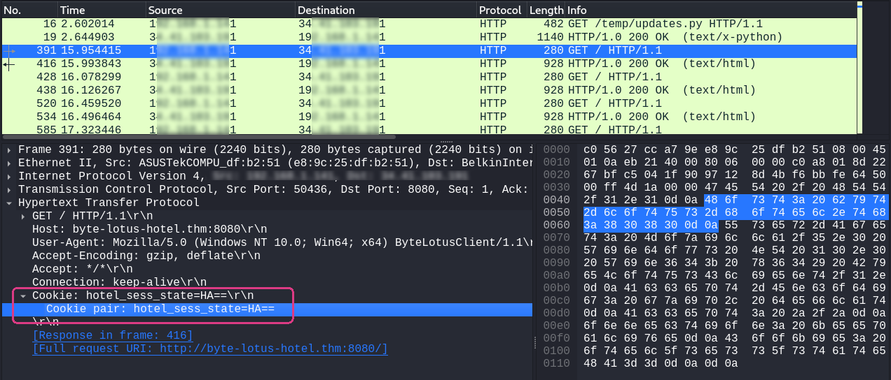
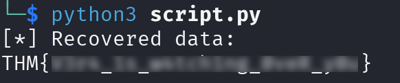

# Overview

**Target**:  [Packed Light](https://tryhackme.com/room/hh-packedlight-02e5330c)

**Difficulty:** Easy

<details>  
<summary>⚠️ Quick summary (spoiler)</summary>  
  
The objective of this challenge was to analyze a network capture and identify a covert communication channel used to exfiltrate sensitive information.
  
</details>

# Traffic Analysis

The investigation began by inspecting the provided packet capture in **Wireshark**.

Filtering the traffic to display only HTTP communications immediately revealed a repetitive pattern: a Python script was transferred over HTTP, followed by a sequence of nearly identical **HTTP GET** requests directed to the same remote endpoint at regular intervals.

The periodic nature of the requests strongly suggested automated activity rather than legitimate user interaction.



# Malware analysis

The transferred file, `updates.py`, was extracted from the capture and analyzed statically.

The code implements a simple keylogger using the **pynput** library to capture keyboard input. Each keystroke is processed individually before being transmitted to a remote command-and-control server.

Several key observations were made during analysis:

- The malware captures every key pressed by the victim.
- Characters are encrypted using a repeating-key XOR cipher.
- The XOR key is hardcoded within the binary.
- The encrypted byte is Base64 encoded.
- Rather than placing the data inside the request body, each encrypted character is hidden inside the value of the HTTP cookie `hotel_sess_state`.
- The malware repeatedly sends HTTP GET requests to the remote server, embedding one encrypted character per request.

The command-and-control endpoint is defined as:

```
http://byte-lotus-hotel.thm:8080/
```

The XOR encryption key is constructed from two concatenated strings:

```
H0t3lSt@ff0NlyK3epS3cr3t!
```



This implementation effectively creates a covert communication channel by disguising keystrokes as ordinary HTTP metadata rather than transmitting them within the request payload.

# Recovering the Flag

Based on the malware's implementation, it became clear that every HTTP request carried a single encrypted character inside the `hotel_sess_state` cookie.



The next step consisted of extracting the cookie values from each observed request.

After collecting every cookie, the encrypted fragments were reconstructed in chronological order.

Because the malware encrypted each character independently, the recovery process consisted of repeating the inverse operations:

1. Decode each cookie from Base64.
2. Decrypt the resulting byte using the recovered XOR key.
3. Concatenate every recovered character to reconstruct the original message.

A short Python script was developed to automate the decoding process.

```python
import base64

KEY = "H0t3lSt@ff0NlyK3epS3cr3t!".encode('utf-8')

def xor_decrypt(data: bytes, key: bytes) -> str:
    return bytes(b ^ key[i % len(key)] for i, b in enumerate(data)).decode('utf-8', errors='ignore')

def decrypt_cookie(b64_cookie_value: str) -> str:
    try:
        encrypted_bytes = base64.b64decode(b64_cookie_value)
        return xor_decrypt(encrypted_bytes, KEY)
    except Exception as e:
        return f"[Error: {e}]"

cookies = [
    "HA==",
    "AA==",
    "BQ==",
	...
]

if __name__ == "__main__":
    flag = "".join([decrypt_cookie(c) for c in cookies])
    
    print("[*] Recovered data:")
    print(flag)
```

Executing the decoder successfully reconstructed the original text transmitted by the malware, revealing the challenge flag.



# Conclusion

This challenge demonstrates a lightweight but effective form of **application-layer data exfiltration**.

Rather than establishing a dedicated encrypted tunnel or using uncommon protocols, the malware leverages standard HTTP requests that closely resemble legitimate web browsing activity.

The exfiltration process combines several techniques:

- **Keyboard interception** using `pynput`.
- **XOR encryption** to avoid transmitting plaintext.
- **Base64 encoding** to ensure safe transmission through HTTP headers.
- **Cookie-based covert channel**, hiding encrypted data within seemingly innocuous HTTP metadata.
- **Periodic beaconing**, generating predictable traffic patterns toward the command-and-control server.

Although neither XOR nor Base64 provides strong cryptographic protection, their combination is sufficient to conceal plaintext from casual inspection and avoid immediate detection during superficial traffic analysis.

The repeated requests also demonstrate a common operational trade-off: transmitting one character per request significantly increases the number of network connections, making behavioral detection possible despite the simplicity of the protocol.

# Real-World Impact

While simplified for educational purposes, this technique closely resembles methods employed by commodity malware and information stealers.

In a real-world environment, such a keylogger could silently capture:

- Usernames and passwords.
- Banking credentials.
- Corporate VPN credentials.
- Internal communications.
- Sensitive documents entered through the keyboard.

By embedding the stolen information within HTTP headers rather than request bodies, the malware attempts to blend into normal web traffic, reducing the likelihood of immediate detection.

Even simple covert channels such as this can remain unnoticed when network monitoring focuses exclusively on payload inspection rather than traffic behavior.

# Remediation

Several defensive measures can significantly reduce the likelihood of this attack succeeding:

- Deploy Endpoint Detection and Response (EDR) solutions capable of detecting keylogging behavior.
- Monitor outbound HTTP traffic for repetitive beaconing patterns and abnormal request frequencies.
- Inspect HTTP headers—not only message bodies—for anomalous or high-entropy values.
- Restrict outbound connections to trusted destinations using network filtering policies.
- Detect unusual applications generating continuous HTTP requests to fixed external hosts.
- Implement behavioral analytics capable of identifying covert channels operating over common protocols.

Because the malware relies entirely on standard HTTP communications, network visibility combined with behavioral analysis provides the strongest opportunity for detection.