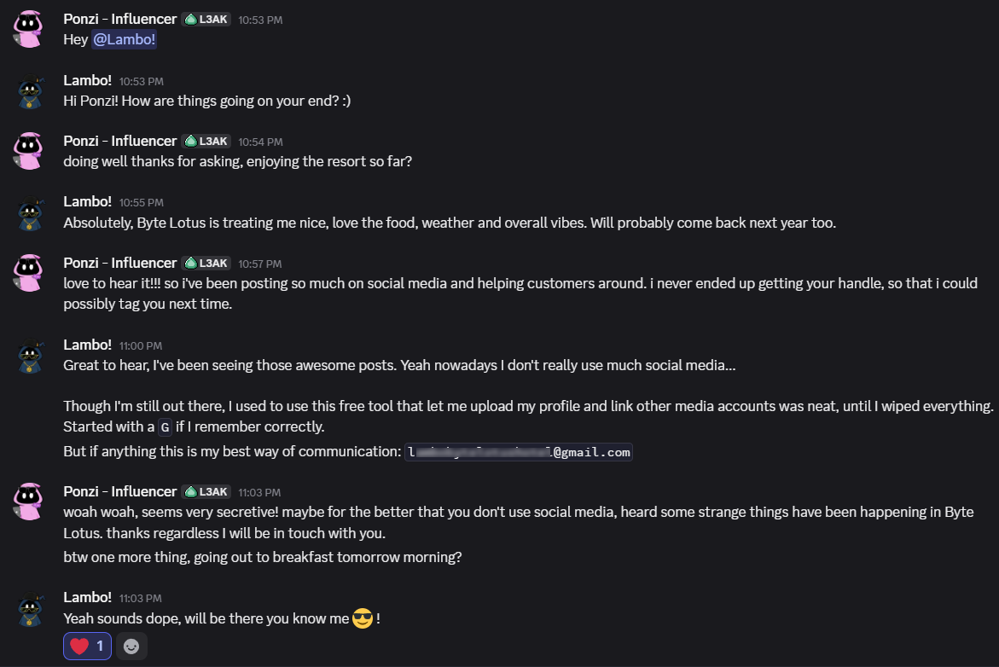
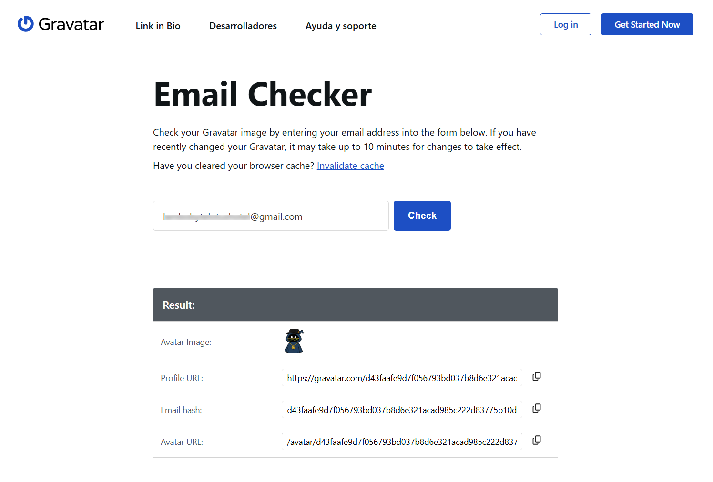
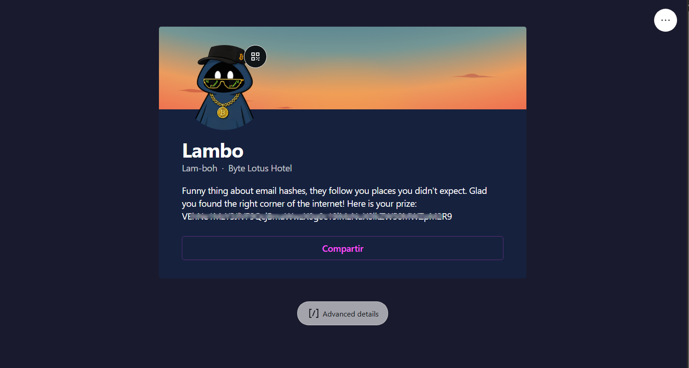
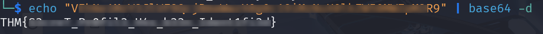

# Overview

**Target**:  [Overheard at Breakfast](https://tryhackme.com/room/hh-overheardatbreakfast-6f01793c)

**Difficulty:** Easy

  

⚠️ Quick summary (spoiler)
  
  
The objective of this challenge was to identify a hidden online account using only publicly available information extracted from a conversation.
  

# Initial Analysis

The challenge provided a single piece of evidence: a screenshot of a private conversation between two guests at the Byte Lotus Resort.

Careful inspection of the dialogue revealed several potentially useful clues.

Most of the conversation consisted of casual discussion until one message stood out:

> _"[...] I used to use this free tool that let me upload my profile and link other media accounts... Started with a G if I remember correctly."_

Later in the conversation, the same user also disclosed an email address.

At first glance, neither piece of information appears particularly sensitive. However, together they provide enough context to begin an OSINT investigation.

# Identifying the Platform

The description of the service was sufficiently specific:

- Free profile service
- Links multiple online accounts
- Name begins with the letter **G**

Several services could potentially match this description, but the combination strongly suggested **Gravatar**.

Gravatar allows users to associate an email address with a publicly accessible profile containing avatars, biographies, and links to other online identities.

# Profile Discovery

After reviewing how Gravatar links accounts to user data, the recovered email address was queried via the profile lookup tool, successfully identifying a matching public profile.

Opening the recovered profile revealed a short biography.

Among the text was the following message:

> _Funny thing about email hashes, they follow you places you didn't expect. Glad you found the right corner of the internet! Here is your prize:_

Immediately below appeared the following Base64-encoded string.

# Flag

The recovered string displayed the typical characteristics of Base64 encoding, including its character set and formatting.

Decoding the value produced the challenge flag.

# Conclusion

This challenge illustrates how small pieces of publicly available information can become valuable intelligence when combined.

An email address shared during what appears to be an ordinary conversation, together with a vague reference to an online service, was sufficient to identify an overlooked public profile containing additional information.

The exercise reinforces a fundamental principle of OSINT investigations: individual details may seem insignificant on their own, but careful correlation of publicly accessible information often reveals a much broader digital footprint than intended. Even abandoned or rarely used services can become useful sources of intelligence when they remain linked to persistent identifiers such as an email address.